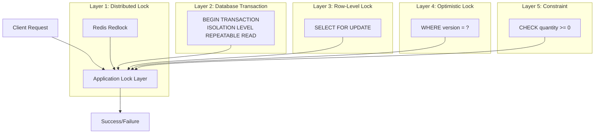

# Best Practices для реализации Atomic Inventory Counter
## Универсальное руководство по работе с конкурентным доступом к ресурсам

---

## 1. Понимание проблемы и бизнес-требований

### 1.1. Кейс: Flash sale / билеты / бронирование
В реальном мире это может быть:
- **Авиабилеты**: 200 мест, 5000 человек пытаются купить одновременно
- **Концерты**: last minute билеты со скидкой
- **Интернет-магазин**: iPhone по акции "первым 100 покупателям"
- **Бронирование отелей**: один номер, два одновременных бронирования

### 1.2. Ключевые требования
```go
type InventoryRequirements struct {
    // Жесткие требования (Must have)
    NoNegative      bool  // Никогда не уходить в минус
    AtomicDecrement bool  // Два параллельных запроса не должны взять 1 товар дважды
    Consistency     bool  // После успешного списания товар реально зарезервирован
    
    // Бизнес-требования
    Overbooking     bool  // Можно ли продать больше чем есть (обычно НЕТ)
    WaitingList     bool  // Очередь на выбывший товар
    PartialAllowed  bool  // Можно ли купить 3, если осталось 2? (обычно НЕТ)
}
```

---

## 2. Стратегии конкурентного доступа

### 2.1. Сравнение подходов

| Стратегия | Механизм | Плюсы | Минусы | Когда использовать |
|-----------|----------|-------|--------|-------------------|
| **Pessimistic Lock** | `SELECT FOR UPDATE` | Гарантированная целостность, простота понимания | Блокирует строки, может быть deadlock, плохо под высокой нагрузкой | Средняя нагрузка, критично к консистентности |
| **Optimistic Lock** | Version column + `UPDATE WHERE version = ?` | Нет блокировок, хорошо масштабируется | Требует retry-логики, может быть много конфликтов | Высокая нагрузка, невысокая конкуренция |
| **Atomic DB Ops** | `UPDATE SET count = count - 1 WHERE count > 0` | Максимальная производительность | Ограниченная логика, сложно с дополнительными действиями | Простые счетчики, не требуется доп. логика |
| **Redis** | `DECR` + watch | Микросекундные задержки | Возможна потеря данных, нет транзакций с БД | Кэширование счетчика, временные акции |
| **Queue-based** | Очередь заказов + worker | Полный контроль, no race conditions | Задержка, сложность | Не требует синхронного ответа |

### 2.2. Production-ready реализация на PostgreSQL

```sql
-- Таблица для инвентаря
CREATE TABLE inventory (
    id BIGSERIAL PRIMARY KEY,
    sku VARCHAR(50) NOT NULL,
    quantity INT NOT NULL CHECK (quantity >= 0),
    reserved INT NOT NULL DEFAULT 0,
    version BIGINT NOT NULL DEFAULT 0,
    updated_at TIMESTAMPTZ NOT NULL DEFAULT NOW(),
    
    -- Констрейнты на уровне БД (последняя линия обороны)
    CONSTRAINT quantity_non_negative CHECK (quantity >= 0),
    CONSTRAINT reserved_non_negative CHECK (reserved >= 0),
    CONSTRAINT available_check CHECK (quantity - reserved >= 0)
);

CREATE INDEX idx_inventory_sku ON inventory(sku);

-- Функция для атомарного уменьшения с проверкой
CREATE OR REPLACE FUNCTION atomic_decrement(
    p_sku VARCHAR,
    p_quantity INT
) RETURNS TABLE (
    success BOOLEAN,
    new_quantity INT,
    old_version BIGINT
) LANGUAGE plpgsql AS $$
DECLARE
    v_current inventory%ROWTYPE;
BEGIN
    -- Pessimistic lock строки
    SELECT * INTO v_current 
    FROM inventory 
    WHERE sku = p_sku 
    FOR UPDATE;
    
    IF NOT FOUND THEN
        RETURN QUERY SELECT false, 0, 0::BIGINT;
        RETURN;
    END IF;
    
    -- Проверяем достаточно ли товара
    IF v_current.quantity - v_current.reserved < p_quantity THEN
        RETURN QUERY SELECT false, v_current.quantity, v_current.version;
        RETURN;
    END IF;
    
    -- Обновляем с проверкой версии (оптимистичный lock для надежности)
    UPDATE inventory 
    SET 
        quantity = quantity - p_quantity,
        version = version + 1,
        updated_at = NOW()
    WHERE 
        sku = p_sku 
        AND version = v_current.version  -- Оптимистичный lock как доп. защита
        AND quantity >= p_quantity;      -- Проверка на уровне SQL
    
    GET DIAGNOSTICS v_current = ROW_COUNT;
    
    IF v_current > 0 THEN
        RETURN QUERY SELECT true, quantity, version + 1 
        FROM inventory WHERE sku = p_sku;
    ELSE
        RETURN QUERY SELECT false, quantity, version 
        FROM inventory WHERE sku = p_sku;
    END IF;
END;
$$;
```

---

## 3. Многослойная защита от race conditions

### 3.1. Схема защиты



### 3.2. Реализация на Go с многослойной защитой

```go
type InventoryService struct {
    db        *sql.DB
    redis     *redis.Client
    metrics   *InventoryMetrics
    logger    *slog.Logger
}

type DecrementRequest struct {
    SKU       string
    Quantity  int
    RequestID string // для идемпотентности
    UserID    string // для аудита
}

type DecrementResult struct {
    Success     bool
    NewQuantity int
    OldVersion  int64
    Error       error
    Retryable   bool
}

func (s *InventoryService) AtomicDecrement(ctx context.Context, req *DecrementRequest) (*DecrementResult, error) {
    startTime := time.Now()
    defer func() {
        s.metrics.ObserveLatency(startTime)
    }()

    // Layer 0: Валидация входных данных
    if req.Quantity <= 0 {
        return nil, ErrInvalidQuantity
    }

    // Layer 1: Distributed lock для предотвращения двойного списания
    lockKey := fmt.Sprintf("inventory:lock:%s", req.SKU)
    lock, err := s.acquireLock(ctx, lockKey, 5*time.Second)
    if err != nil {
        // Если не получили lock, но это не критично - пробуем без него
        s.logger.Warn("failed to acquire distributed lock", "sku", req.SKU, "error", err)
    } else {
        defer lock.Release()
    }

    // Layer 2: Database transaction с правильным isolation level
    tx, err := s.db.BeginTx(ctx, &sql.TxOptions{
        Isolation: sql.LevelRepeatableRead,
        ReadOnly:  false,
    })
    if err != nil {
        return nil, fmt.Errorf("begin tx: %w", err)
    }
    defer tx.Rollback() // безопасный rollback, если commit не был вызван

    // Layer 3: Pessimistic lock + версионность
    var current struct {
        Quantity int
        Reserved int
        Version  int64
    }
    
    err = tx.QueryRowContext(ctx, `
        SELECT quantity, reserved, version 
        FROM inventory 
        WHERE sku = $1 
        FOR UPDATE  -- pessimistic lock
    `, req.SKU).Scan(&current.Quantity, &current.Reserved, &current.Version)
    
    if err == sql.ErrNoRows {
        return nil, ErrSKUNotFound
    }
    if err != nil {
        return nil, fmt.Errorf("query current: %w", err)
    }

    // Проверяем достаточно ли товара
    available := current.Quantity - current.Reserved
    if available < req.Quantity {
        s.metrics.IncInsufficientStock(req.SKU)
        
        // Логируем для аналитики
        s.logger.Warn("insufficient stock",
            "sku", req.SKU,
            "requested", req.Quantity,
            "available", available,
            "user_id", req.UserID,
        )
        
        return &DecrementResult{
            Success:     false,
            NewQuantity: current.Quantity,
            Error:       ErrInsufficientStock,
        }, nil
    }

    // Layer 4: Optimistic lock update
    result, err := tx.ExecContext(ctx, `
        UPDATE inventory 
        SET 
            quantity = quantity - $1,
            reserved = reserved,
            version = version + 1,
            updated_at = NOW()
        WHERE 
            sku = $2 
            AND version = $3  -- оптимистичный lock
            AND quantity >= $1  -- защита от некорректных данных
    `, req.Quantity, req.SKU, current.Version)
    
    if err != nil {
        return nil, fmt.Errorf("update: %w", err)
    }

    rows, err := result.RowsAffected()
    if err != nil {
        return nil, fmt.Errorf("rows affected: %w", err)
    }

    if rows == 0 {
        // Конфликт версий - кто-то изменил данные между SELECT и UPDATE
        s.metrics.IncOptimisticLockConflict(req.SKU)
        
        return &DecrementResult{
            Success:   false,
            Error:     ErrOptimisticLockConflict,
            Retryable: true, // можно повторить
        }, nil
    }

    // Layer 5: Аудитный лог (для compliance)
    _, err = tx.ExecContext(ctx, `
        INSERT INTO inventory_audit (
            sku, user_id, request_id, quantity_delta, 
            old_quantity, new_quantity, created_at
        ) VALUES ($1, $2, $3, $4, $5, $6, NOW())
    `, req.SKU, req.UserID, req.RequestID, -req.Quantity,
        current.Quantity, current.Quantity-req.Quantity)
    
    if err != nil {
        s.logger.Error("failed to write audit log", "error", err)
        // Не откатываем транзакцию, только логируем
    }

    // Layer 6: Коммит транзакции
    if err = tx.Commit(); err != nil {
        return nil, fmt.Errorf("commit: %w", err)
    }

    // Layer 7: Инвалидация кэша
    s.invalidateCache(ctx, req.SKU)

    // Успех!
    s.metrics.IncSuccessfulDecrement(req.SKU, req.Quantity)
    
    return &DecrementResult{
        Success:     true,
        NewQuantity: current.Quantity - req.Quantity,
        OldVersion:  current.Version,
    }, nil
}
```

---

## 4. Обработка ошибок и retry логика

### 4.1. Классификация ошибок

```go
type ErrorClass int

const (
    ErrorClassRetryable ErrorClass = iota // можно повторить
    ErrorClassPermanent                    // повторять бесполезно
    ErrorClassThrottled                    // слишком много запросов
)

func classifyError(err error) ErrorClass {
    switch {
    case errors.Is(err, ErrOptimisticLockConflict):
        return ErrorClassRetryable
    case errors.Is(err, ErrInsufficientStock):
        return ErrorClassPermanent
    case errors.Is(err, context.DeadlineExceeded):
        return ErrorClassRetryable
    case errors.Is(err, ErrDeadlock):
        return ErrorClassRetryable
    default:
        return ErrorClassPermanent
    }
}
```

### 4.2. Retry механизм с экспоненциальной задержкой

```go
type RetryConfig struct {
    MaxAttempts     int
    InitialInterval time.Duration
    MaxInterval     time.Duration
    Multiplier      float64
    Jitter          float64 // случайность для избежания thundering herd
}

func (s *InventoryService) WithRetry(ctx context.Context, req *DecrementRequest) (*DecrementResult, error) {
    config := &RetryConfig{
        MaxAttempts:     3,
        InitialInterval: 100 * time.Millisecond,
        MaxInterval:     2 * time.Second,
        Multiplier:      2.0,
        Jitter:          0.1,
    }

    var result *DecrementResult
    var err error

    for attempt := 0; attempt < config.MaxAttempts; attempt++ {
        // Проверяем контекст перед каждым attempt
        if err := ctx.Err(); err != nil {
            return nil, fmt.Errorf("context cancelled: %w", err)
        }

        result, err = s.AtomicDecrement(ctx, req)
        
        if err == nil {
            if result.Success {
                return result, nil
            }
            // Успешный запрос но не успешная операция (не хватило товара)
            if !result.Retryable {
                return result, nil
            }
        }

        // Классифицируем ошибку
        errorClass := classifyError(err)
        if errorClass == ErrorClassPermanent {
            return result, err
        }

        // Вычисляем задержку с jitter
        backoff := s.calculateBackoff(attempt, config)
        
        s.logger.Debug("retrying operation",
            "attempt", attempt+1,
            "max_attempts", config.MaxAttempts,
            "backoff", backoff,
            "error", err,
        )

        select {
        case <-ctx.Done():
            return nil, ctx.Err()
        case <-time.After(backoff):
            continue
        }
    }

    return nil, fmt.Errorf("max retry attempts exceeded: %w", err)
}

func (s *InventoryService) calculateBackoff(attempt int, config *RetryConfig) time.Duration {
    if attempt == 0 {
        return config.InitialInterval
    }

    // Экспоненциальный рост
    interval := float64(config.InitialInterval) * math.Pow(config.Multiplier, float64(attempt))
    if interval > float64(config.MaxInterval) {
        interval = float64(config.MaxInterval)
    }

    // Добавляем jitter для избежания thundering herd
    jitter := interval * config.Jitter * (rand.Float64()*2 - 1)
    
    return time.Duration(interval + jitter)
}
```

---

## 5. Мониторинг и метрики

### 5.1. Ключевые метрики

```go
type InventoryMetrics struct {
    // Счетчики операций
    decrementsTotal *prometheus.CounterVec
    successesTotal  *prometheus.CounterVec
    failuresTotal   *prometheus.CounterVec
    
    // Бизнес-метрики
    stockLevel      *prometheus.GaugeVec
    reservedLevel   *prometheus.GaugeVec
    
    // Технические метрики
    operationDuration *prometheus.HistogramVec
    lockContention    *prometheus.CounterVec
    retryAttempts     *prometheus.HistogramVec
    
    // Race condition метрики
    optimisticLockConflicts *prometheus.CounterVec
    deadlocks              *prometheus.CounterVec
}

func NewInventoryMetrics(reg *prometheus.Registry) *InventoryMetrics {
    m := &InventoryMetrics{
        decrementsTotal: promauto.With(reg).NewCounterVec(
            prometheus.CounterOpts{
                Name: "inventory_decrements_total",
                Help: "Total number of decrement attempts",
            },
            []string{"sku", "result"}, // result: success, insufficient, error
        ),
        
        optimisticLockConflicts: promauto.With(reg).NewCounterVec(
            prometheus.CounterOpts{
                Name: "inventory_optimistic_lock_conflicts_total",
                Help: "Number of optimistic lock conflicts",
            },
            []string{"sku"},
        ),
        
        operationDuration: promauto.With(reg).NewHistogramVec(
            prometheus.HistogramOpts{
                Name:    "inventory_operation_duration_seconds",
                Help:    "Duration of inventory operations",
                Buckets: []float64{.001, .005, .01, .025, .05, .1, .25, .5, 1},
            },
            []string{"operation", "result"},
        ),
        
        stockLevel: promauto.With(reg).NewGaugeVec(
            prometheus.GaugeOpts{
                Name: "inventory_stock_level",
                Help: "Current stock level by SKU",
            },
            []string{"sku"},
        ),
    }
    
    // Запускаем периодическое обновление stock level
    go m.periodicallyUpdateStockLevels(context.Background(), 30*time.Second)
    
    return m
}
```

### 5.2. Структурированное логирование

```go
type InventoryLog struct {
    Level       string    `json:"level"`
    Timestamp   time.Time `json:"@timestamp"`
    Operation   string    `json:"operation"` // "decrement", "reserve", "restore"
    
    // Контекст
    SKU         string    `json:"sku"`
    RequestID   string    `json:"request_id"`
    UserID      string    `json:"user_id,omitempty"`
    
    // Данные операции
    Quantity    int       `json:"quantity"`
    BeforeQty   int       `json:"before_quantity"`
    AfterQty    int       `json:"after_quantity"`
    Version     int64     `json:"version"`
    
    // Результат
    Success     bool      `json:"success"`
    Error       string    `json:"error,omitempty"`
    Retryable   bool      `json:"retryable,omitempty"`
    
    // Производительность
    Duration    string    `json:"duration_ms"`
    RetryCount  int       `json:"retry_count,omitempty"`
}

func (s *InventoryService) logOperation(ctx context.Context, log *InventoryLog) {
    // Всегда добавляем trace информацию
    log.Timestamp = time.Now()
    
    if span := trace.SpanFromContext(ctx); span != nil {
        log.RequestID = span.SpanContext().TraceID().String()
    }
    
    // Определяем уровень логирования
    level := slog.LevelInfo
    if log.Error != "" {
        level = slog.LevelError
    }
    
    s.logger.Log(ctx, level, "inventory operation",
        "sku", log.SKU,
        "operation", log.Operation,
        "success", log.Success,
        "duration", log.Duration,
        "error", log.Error,
    )
}
```

### 5.3. Алерты

```yaml
alerts:
  - name: "High Optimistic Lock Conflict Rate"
    condition: "rate(inventory_optimistic_lock_conflicts_total[5m]) > 10"
    severity: "warning"
    description: "High contention on inventory updates"
    summary: "Too many retries due to concurrent updates"
    
  - name: "Stock Level Critical"
    condition: "inventory_stock_level{sku='POPULAR_ITEM'} < 10"
    severity: "critical"
    description: "Popular item running out of stock"
    
  - name: "High Operation Latency"
    condition: "histogram_quantile(0.95, rate(inventory_operation_duration_bucket[5m])) > 0.5"
    severity: "warning"
    description: "Inventory operations are slow"
    
  - name: "Multiple Deadlocks"
    condition: "increase(inventory_deadlocks_total[5m]) > 0"
    severity: "critical"
    description: "Database deadlocks detected in inventory operations"
```

---

## 6. Тестирование

### 6.1. Тест на race conditions

```go
func TestInventory_ConcurrentDecrements(t *testing.T) {
    if testing.Short() {
        t.Skip("skipping race test in short mode")
    }

    // Setup
    db := setupTestDB(t)
    service := NewInventoryService(db, redis.NewClient(&redis.Options{}))
    
    ctx := context.Background()
    sku := "TEST-SKU-001"
    initialQty := 100
    
    // Инициализируем инвентарь
    err := service.InitInventory(ctx, sku, initialQty)
    require.NoError(t, err)

    // Запускаем конкурентные запросы
    const numRequests = 1000
    const decrementQty = 1
    
    var wg sync.WaitGroup
    results := make(chan *DecrementResult, numRequests)
    
    for i := 0; i < numRequests; i++ {
        wg.Add(1)
        go func(requestID int) {
            defer wg.Done()
            
            result, err := service.AtomicDecrement(ctx, &DecrementRequest{
                SKU:       sku,
                Quantity:  decrementQty,
                RequestID: fmt.Sprintf("req-%d", requestID),
                UserID:    "test-user",
            })
            
            if err != nil {
                t.Logf("Request %d failed: %v", requestID, err)
                results <- &DecrementResult{Success: false, Error: err}
            } else {
                results <- result
            }
        }(i)
    }
    
    // Ждем завершения всех горутин
    wg.Wait()
    close(results)

    // Анализируем результаты
    var successCount int
    var insufficientCount int
    var conflictCount int
    
    for res := range results {
        if res.Success {
            successCount++
        } else if errors.Is(res.Error, ErrInsufficientStock) {
            insufficientCount++
        } else if errors.Is(res.Error, ErrOptimisticLockConflict) {
            conflictCount++
        }
    }

    // Проверяем инварианты
    finalInventory, err := service.GetInventory(ctx, sku)
    require.NoError(t, err)
    
    // Общее количество списанных товаров должно равняться initial - final
    assert.Equal(t, initialQty, finalInventory.Quantity+successCount)
    
    // Никогда не должно быть negative
    assert.GreaterOrEqual(t, finalInventory.Quantity, 0)
    
    // Сумма успешных и недостаточных должна равняться общему числу запросов
    // (конфликты это retry, они не должны уменьшать счетчик)
    assert.Equal(t, numRequests, successCount+insufficientCount)
    
    t.Logf("Results: %d success, %d insufficient, %d conflicts",
        successCount, insufficientCount, conflictCount)
}
```

### 6.2. Нагрузочное тестирование

```go
func BenchmarkInventory_Concurrent(b *testing.B) {
    db := setupBenchDB(b)
    service := NewInventoryService(db, redis.NewClient(&redis.Options{}))
    
    sku := "BENCH-SKU"
    service.InitInventory(context.Background(), sku, 1000000)
    
    b.RunParallel(func(pb *testing.PB) {
        requestID := 0
        for pb.Next() {
            requestID++
            _, err := service.AtomicDecrement(context.Background(), &DecrementRequest{
                SKU:       sku,
                Quantity:  1,
                RequestID: fmt.Sprintf("bench-%d", requestID),
                UserID:    "bench-user",
            })
            if err != nil && !errors.Is(err, ErrInsufficientStock) {
                b.Errorf("Unexpected error: %v", err)
            }
        }
    })
}
```

### 6.3. Тесты на изоляцию и целостность

```go
func TestInventory_TransactionIsolation(t *testing.T) {
    // Тест на фантомное чтение
    t.Run("phantom read", func(t *testing.T) {
        // Проверяем, что REPEATABLE READ предотвращает фантомы
    })
    
    // Тест на неповторяющееся чтение
    t.Run("non-repeatable read", func(t *testing.T) {
        // Проверяем, что SELECT FOR UPDATE блокирует строку
    })
    
    // Тест на потерянные обновления
    t.Run("lost update", func(t *testing.T) {
        // Проверяем, что два параллельных UPDATE не теряют изменения
    })
    
    // Тест на deadlock
    t.Run("deadlock detection", func(t *testing.T) {
        // Проверяем, что deadlock приводит к ошибке, а не к зависанию
    })
}
```

---

## 7. Production чек-лист

### ✅ Must have (критично для продакшена)
- [ ] **Никогда не уходить в минус**: CHECK constraint на уровне БД
- [ ] **Атомарность операций**: Транзакции с правильным isolation level
- [ ] **Защита от race conditions**: `SELECT FOR UPDATE` или version column
- [ ] **Deadlock detection и retry**: Обнаружение и повтор deadlock-ов
- [ ] **Timeout на все операции**: Не ждать вечно блокировок
- [ ] **Метрики**: latency, success rate, conflict rate
- [ ] **Логирование**: Аудит всех изменений
- [ ] **Graceful degradation**: При недоступности Redis не падать

### ⚠️ Should have (важно для production readiness)
- [ ] **Идемпотентность**: Защита от повторных запросов
- [ ] **Circuit breaker**: Защита от каскадных отказов
- [ ] **Rate limiting**: Защита от DoS на inventory endpoints
- [ ] **Интеграционные тесты**: Тесты с реальной БД под нагрузкой
- [ ] **Документация**: API контракты, примеры использования
- [ ] **Резервирование**: Механизм reservation + confirmation

### 🚀 Nice to have (для enterprise уровня)
- [ ] **Распределенные транзакции**: SAGA паттерн для跨-сервисных операций
- [ ] **Прогнозирование**: ML модели для предсказания дефицита
- [ ] **Динамическое ценообразование**: Изменение цены при дефиците
- [ ] **А/B тестирование**: Разных стратегий блокировок
- [ ] **Автоматическое масштабирование**: При пиковых нагрузках

---

## 8. Типичные ошибки и их решения

### 8.1. Ошибка: Использование `SELECT ... FOR UPDATE` без индекса
```sql
-- ПЛОХО: Блокирует всю таблицу
SELECT * FROM inventory WHERE sku = 'test' FOR UPDATE;

-- ХОРОШО: Использует индекс, блокирует только нужную строку
-- Нужен индекс: CREATE INDEX idx_inventory_sku ON inventory(sku);
SELECT * FROM inventory WHERE sku = 'test' FOR UPDATE;
```

### 8.2. Ошибка: Долгая транзакция с блокировками
```go
// ПЛОХО: Держим блокировку во время внешнего вызова
func (s *InventoryService) BadDecrement(ctx context.Context, sku string) error {
    tx, _ := s.db.Begin()
    defer tx.Rollback()
    
    // Блокируем строку
    var qty int
    tx.QueryRow("SELECT quantity FROM inventory WHERE sku = $1 FOR UPDATE", sku).Scan(&qty)
    
    // ДЕЛАЕМ ВНЕШНИЙ ВЫЗОВ (HTTP, Kafka) - БЛОКИРОВКА ДЕРЖИТСЯ!
    err := s.paymentService.Charge(ctx, ...)
    if err != nil {
        return err
    }
    
    tx.Exec("UPDATE inventory SET quantity = $1 WHERE sku = $2", qty-1, sku)
    return tx.Commit()
}

// ХОРОШО: Блокируем только на время обновления
func (s *InventoryService) GoodDecrement(ctx context.Context, sku string) error {
    // Сначала делаем внешние вызовы
    err := s.paymentService.Charge(ctx, ...)
    if err != nil {
        return err
    }
    
    // Только потом короткая транзакция
    return s.AtomicDecrement(ctx, sku, 1)
}
```

### 8.3. Ошибка: Неправильный isolation level
```sql
-- ПЛОХО: READ COMMITTED может дать фантомы
SET TRANSACTION ISOLATION LEVEL READ COMMITTED;

-- ХОРОХО: REPEATABLE READ или SERIALIZABLE для инвентаря
SET TRANSACTION ISOLATION LEVEL REPEATABLE READ;
```

### 8.4. Ошибка: Необработанный deadlock
```go
// ПЛОХО: Deadlock приводит к ошибке 500
func (s *InventoryService) BadDecrement() {
    _, err := db.Exec("UPDATE inventory SET quantity = quantity - 1 WHERE sku = $1", sku)
    if err != nil {
        // Просто возвращаем 500
        return err
    }
}

// ХОРОШО: Обнаруживаем deadlock и повторяем
func (s *InventoryService) GoodDecrement() error {
    for attempts := 0; attempts < 3; attempts++ {
        _, err := db.Exec("UPDATE inventory SET quantity = quantity - 1 WHERE sku = $1", sku)
        if err == nil {
            return nil
        }
        
        // Проверяем код ошибки deadlock (PostgreSQL: 40P01)
        if pgErr, ok := err.(*pq.Error); ok && pgErr.Code == "40P01" {
            time.Sleep(time.Duration(attempts*100) * time.Millisecond)
            continue
        }
        return err
    }
    return fmt.Errorf("max deadlock retry attempts exceeded")
}
```

---

## Заключение

Atomic inventory — это классическая задача конкурентного программирования, где нужно балансировать между:

1. **Целостностью данных** — никогда не продавать больше чем есть
2. **Производительностью** — обрабатывать тысячи запросов в секунду
3. **Пользовательским опытом** — давать честный шанс всем желающим

Ключевые выводы:
- **Никогда не доверяйте одному слою защиты** — используйте multi-layer подход
- **Измеряйте всё** — latency, конфликты, deadlock-и
- **Тестируйте под нагрузкой** — race conditions проявляются только при конкуренции
- **Имейте план Б** — при сбоях блокируйте, а не пропускайте некорректные операции
- **Думайте о бизнесе** — техническое решение должно удовлетворять бизнес-требованиям
