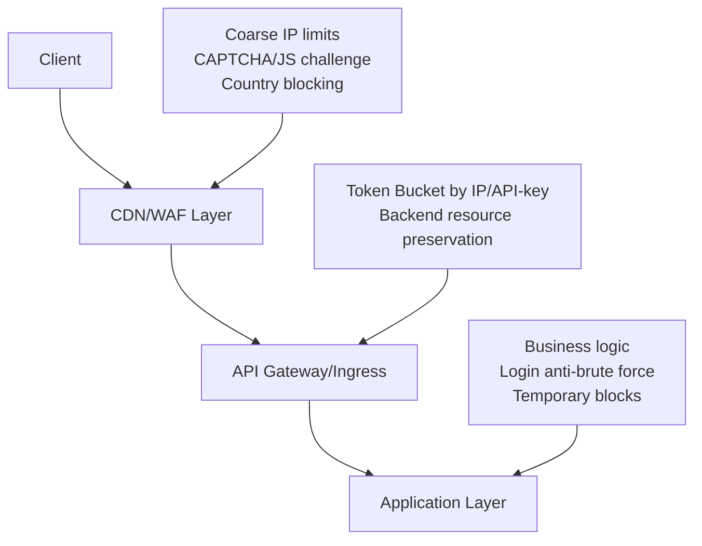

# Best Practices for Rate Limiting Implementation
## Universal Guide for Brute Force and DoS Protection

---

## 1. Client Identification

### 1.1. Correct IP Address Extraction
The most common mistake is using `req.remoteAddr` directly. In production, the application is always behind proxies (nginx, ingress, Cloudflare).

**Correct Implementation:**

```go
type ClientIdentifier struct {
    // List of trusted proxies (CIDR)
    TrustedProxies []*net.IPNet
    // Headers for IP extraction in priority order
    Headers []string
}

func (ci *ClientIdentifier) GetClientIP(r *http.Request) string {
    // 1. Check headers from trusted proxies
    for _, header := range ci.Headers {
        if headerValue := r.Header.Get(header); headerValue != "" {
            // Check that the request came from a trusted proxy
            if ci.isFromTrustedProxy(r.RemoteAddr) {
                return ci.extractFirstIP(headerValue)
            }
        }
    }
    
    // 2. Fallback to RemoteAddr (strip port)
    host, _, _ := net.SplitHostPort(r.RemoteAddr)
    return host
}

// IPv6 normalization
func normalizeIP(ip string) string {
    parsed := net.ParseIP(ip)
    if parsed == nil {
        return ip
    }
    return parsed.String() // Converts to canonical form
}
```

**Default Configuration:**
```yaml
client_identification:
  trusted_proxies:
    - "10.0.0.0/8"      # Internal networks
    - "172.16.0.0/12"
    - "192.168.0.0/16"
  headers:
    - "X-Forwarded-For"  # Standard proxy header
    - "X-Real-IP"        # Alternative header
  strip_port: true       # Always remove port
```

### 1.2. Forming Keys for Rate Limiting

**Never use IP with port** — this allows bypassing protection by simply opening multiple connections.

**Correct Composite Keys:**

```go
type RateLimitKey struct {
    Components []string
    Separator  string
}

func (k *RateLimitKey) Build() string {
    return strings.Join(k.Components, k.Separator)
}

// Key examples for different scenarios
var keys = struct {
    // For login brute force protection
    LoginByIP func(ip, endpoint string) *RateLimitKey
    LoginByUser func(username string) *RateLimitKey
    LoginCombined func(ip, username string) *RateLimitKey
    
    // For API key based protection
    APIKey func(apiKey, endpoint string) *RateLimitKey
    
    // For authorized users
    User func(userID, endpoint string) *RateLimitKey
}{
    LoginByIP: func(ip, endpoint string) *RateLimitKey {
        return &RateLimitKey{
            Components: []string{"ratelimit", "login", "ip", normalizeIP(ip), endpoint},
            Separator:  ":",
        }
    },
    LoginByUser: func(username string) *RateLimitKey {
        return &RateLimitKey{
            Components: []string{"ratelimit", "login", "user", username},
            Separator:  ":",
        }
    },
    // ... remaining combinations
}
```

**Key Formation Rule:**
- Always include the limit type (login, api, general)
- Always normalize IP (without port, canonical format)
- For user identifiers, use hashes (PII protection)
- In production — add prefix for environment isolation (dev/staging/prod)

---

## 2. Multi-layered Architecture Protection

### 2.1. Responsibility Distribution Scheme



### 2.2. Configuration for Each Layer

**Layer 1: CDN/WAF (Cloudflare, AWS WAF, Cloud Armor)**
```yaml
# Global infrastructure protection
rate_limits:
  - name: "global_ip_limit"
    key: "${ip}"
    matcher: 
      path: "/api/*"
    limits:
      - count: 1000
        period: "1m"      # No more than 1000 requests per minute from IP
      - count: 10000
        period: "1h"       # No more than 10000 per hour
        
  - name: "login_endpoint_protection"
    key: "${ip}"
    matcher:
      path: "/api/v1/login"
    limits:
      - count: 10
        period: "1m"       # 10 attempts per minute to /login
    action: "challenge"    # When exceeded - show CAPTCHA
```

**Layer 2: API Gateway / Ingress (NGINX, Envoy, Kong)**
```lua
-- Example for Kong/OpenResty
local limits = {
    -- Basic limit for all requests
    {
        key = ngx.var.binary_remote_addr,
        window = "60s",
        limit = 1000,
    },
    -- Limit for authorization endpoints
    {
        key = ngx.var.binary_remote_addr,
        window = "60s",
        limit = 30,
        path = {"/login", "/register", "/reset-password"}
    }
}
```

**Layer 3: Application Layer (your code)**
```go
type RateLimitMiddleware struct {
    // Time sliding
    slidingWindow   *SlidingWindowLog
    // Race condition protection
    pessimisticLock *RedisLock
    // Different limits for different strategies
    limits          map[string]*LimitRule
}

type LimitRule struct {
    Key        string // Key template
    Window     time.Duration
    MaxRequests int64
    Strategy   string // "sliding_window", "token_bucket", "leaky_bucket"
    Burst      int64  // For token bucket
}
```

---

## 3. Algorithms and Data Structures

### 3.1. Algorithm Comparison for Different Scenarios

| Algorithm | Use Case | Pros | Cons | Prod-ready |
|-----------|----------|------|------|------------|
| **Fixed Window** | General limits, monitoring | Simple, minimal overhead | Window boundary problem | ✅ Yes |
| **Sliding Window Log** | Anti-brute force, precise limits | Maximally precise | High memory usage in Redis | ✅ Yes (with Lua) |
| **Sliding Window Counter** | API limits, high load | Compromise precision/memory | Less precision than Log | ✅ Yes |
| **Token Bucket** | Traffic shaping, burst | Supports burst, smooth | Harder to debug | ✅ Yes |
| **Leaky Bucket** | Stable outflow | Predictable outflow | Not flexible | ⚠️ Rarely |

### 3.2. Production-ready Redis Lua Script (Sliding Window Log)

```lua
-- KEYS[1] = key (e.g., "ratelimit:login:ip:192.168.1.1")
-- ARGV[1] = current time (unix timestamp)
-- ARGV[2] = window size in seconds
-- ARGV[3] = maximum number of requests
-- ARGV[4] = request weight (usually 1)

local key = KEYS[1]
local now = tonumber(ARGV[1])
local window = tonumber(ARGV[2])
local max = tonumber(ARGV[3])
local weight = tonumber(ARGV[4]) or 1

-- Remove outdated entries
redis.call('ZREMRANGEBYSCORE', key, 0, now - window * 1000)

-- Count current number
local current = redis.call('ZCARD', key)

if current + weight > max then
    -- Get time until oldest element expires
    local oldest = redis.call('ZRANGE', key, 0, 0, 'WITHSCORES')
    local retry_after = 0
    
    if oldest[2] then
        retry_after = math.ceil((oldest[2] + window * 1000 - now) / 1000)
    end
    
    return {
        0,                      -- allowed
        current,                -- current_count
        max,                    -- limit
        retry_after,            -- retry_after_seconds
        now / 1000              -- current_time_seconds
    }
end

-- Add new request
redis.call('ZADD', key, now, now .. ':' .. math.random())
redis.call('EXPIRE', key, window * 2)  -- TTL with buffer

return {
    1,                          -- allowed
    current + weight,           -- current_count
    max,                        -- limit
    0,                          -- retry_after_seconds
    now / 1000                  -- current_time_seconds
}
```

---

## 4. Business Logic and Reactions

### 4.1. Multi-level Limits for Login Protection

```go
type LoginProtection struct {
    // Limits for different protection levels
    levels []struct {
        attempts    int
        window      time.Duration
        action      func(*http.Request, string)
        blockPeriod time.Duration
    }
}

func (lp *LoginProtection) Check(ctx context.Context, ip, login string) (*Result, error) {
    // 1. Check by IP
    ipResult := lp.checkIP(ctx, ip)
    
    // 2. Check by login (protection against distributed attacks)
    loginResult := lp.checkLogin(ctx, login)
    
    // 3. Check IP+login combination
    combinedResult := lp.checkCombined(ctx, ip, login)
    
    // 4. Determine severity and action
    severity := lp.calculateSeverity(ipResult, loginResult, combinedResult)
    
    switch severity {
    case SeverityLow:
        // Just log
        return &Result{Allowed: true}, nil
        
    case SeverityMedium:
        // Return 429 with Retry-After
        return &Result{
            Allowed:     false,
            StatusCode:  429,
            RetryAfter:  30,
            Message:     "Too many attempts, please try again later",
        }, nil
        
    case SeverityHigh:
        // Temporary account block
        lp.tempBlockAccount(ctx, login, 24*time.Hour)
        return &Result{
            Allowed:     false,
            StatusCode:  403,
            Message:     "Account temporarily locked. Contact support.",
        }, nil
        
    case SeverityCritical:
        // Require additional verification
        return &Result{
            Allowed:     false,
            StatusCode:  401,
            Require2FA:  true,
            Message:     "Additional verification required",
        }, nil
    }
}
```

### 4.2. Retry-After and Client Information

```go
type RateLimitResponse struct {
    StatusCode    int           `json:"-"`
    Message       string        `json:"message,omitempty"`
    RetryAfter    int           `json:"retry_after,omitempty"` // seconds
    Limit         int64         `json:"limit"`
    Remaining     int64         `json:"remaining"`
    Reset         int64         `json:"reset"` // unix timestamp
}

func (rl *RateLimitMiddleware) writeRateLimitHeaders(w http.ResponseWriter, r *RateLimitResponse) {
    w.Header().Set("X-RateLimit-Limit", strconv.FormatInt(r.Limit, 10))
    w.Header().Set("X-RateLimit-Remaining", strconv.FormatInt(r.Remaining, 10))
    w.Header().Set("X-RateLimit-Reset", strconv.FormatInt(r.Reset, 10))
    
    if r.RetryAfter > 0 {
        w.Header().Set("Retry-After", strconv.Itoa(r.RetryAfter))
        // RFC 7231 date format
        retryTime := time.Now().Add(time.Duration(r.RetryAfter) * time.Second)
        w.Header().Set("Retry-After", retryTime.Format(time.RFC1123))
    }
    
    w.WriteHeader(r.StatusCode)
    json.NewEncoder(w).Encode(r)
}
```

---

## 5. Observability and Monitoring

### 5.1. Prometheus Metrics

```go
type RateLimitMetrics struct {
    // Exceeded counters
    exceededTotal *prometheus.CounterVec
    
    // Current limit state
    currentLoad *prometheus.GaugeVec
    
    // Processing time
    checkDuration *prometheus.HistogramVec
    
    // Active blocks
    activeBlocks *prometheus.GaugeVec
}

func InitMetrics() *RateLimitMetrics {
    m := &RateLimitMetrics{
        exceededTotal: prometheus.NewCounterVec(
            prometheus.CounterOpts{
                Name: "ratelimit_exceeded_total",
                Help: "Total number of rate limit exceeded events",
            },
            []string{"limiter_type", "endpoint", "severity"},
        ),
        
        currentLoad: prometheus.NewGaugeVec(
            prometheus.GaugeOpts{
                Name: "ratelimit_current_load",
                Help: "Current load per limiter",
            },
            []string{"limiter_type", "key"},
        ),
        
        checkDuration: prometheus.NewHistogramVec(
            prometheus.HistogramOpts{
                Name:    "ratelimit_check_duration_seconds",
                Help:    "Time spent checking rate limits",
                Buckets: prometheus.DefBuckets,
            },
            []string{"limiter_type"},
        ),
    }
    
    prometheus.MustRegister(m.exceededTotal, m.currentLoad, m.checkDuration)
    return m
}
```

### 5.2. Structured Logging

```go
type RateLimitLog struct {
    Level       string                 `json:"level"`
    Timestamp   time.Time              `json:"@timestamp"`
    Type        string                 `json:"type"` // "rate_limit_exceeded", "account_blocked"
    
    // Request context
    IP          string                 `json:"client_ip"`
    UserID      string                 `json:"user_id,omitempty"`
    Login       string                 `json:"login,omitempty"`
    Endpoint    string                 `json:"endpoint"`
    Method      string                 `json:"method"`
    
    // Limits
    LimitType   string                 `json:"limit_type"` // "ip", "login", "combined"
    Limit       int64                   `json:"limit"`
    Current     int64                   `json:"current"`
    Window      int                     `json:"window_seconds"`
    
    // Result
    Allowed     bool                    `json:"allowed"`
    StatusCode  int                     `json:"status_code"`
    RetryAfter  int                     `json:"retry_after,omitempty"`
    
    // Metadata
    RequestID   string                 `json:"request_id"`
    Environment string                 `json:"environment"`
}
```

### 5.3. Alerts

```yaml
alerts:
  - name: "High Rate Limit Exceeded Rate"
    condition: "rate(ratelimit_exceeded_total[5m]) > 100"
    severity: "warning"
    description: "High number of rate limit violations"
    
  - name: "Multiple Accounts Blocked"
    condition: "increase(ratelimit_exceeded_total{severity='high'}[10m]) > 10"
    severity: "critical"
    description: "Possible distributed attack in progress"
    
  - name: "Redis Latency"
    condition: "histogram_quantile(0.95, rate(ratelimit_check_duration_bucket[5m])) > 0.1"
    severity: "warning"
    description: "Rate limiter is slowing down requests"
```

---

## 6. Configurability and Feature Flags

### 6.1. Flexible Configuration (YAML + env)

```yaml
rate_limiter:
  enabled: true
  
  # Global settings
  default_strategy: "sliding_window"
  key_prefix: "prod:ratelimit"
  
  # IP source
  ip_source:
    trust_proxies: true
    proxies_cidr:
      - "10.0.0.0/8"
      - "172.16.0.0/12"
      - "192.168.0.0/16"
    headers_priority:
      - "X-Forwarded-For"
      - "X-Real-IP"
  
  # Rules for different endpoints
  rules:
    - name: "login_ip"
      endpoint: "/api/v1/login"
      key_pattern: "{ip}"
      window: "1m"
      limit: 5
      strategy: "sliding_window_log"
      severity: "medium"
      
    - name: "login_user"
      endpoint: "/api/v1/login"
      key_pattern: "user:{login}"
      window: "15m"
      limit: 10
      strategy: "sliding_window_log"
      severity: "high"
      on_exceed:
        - action: "block_account"
          duration: "1h"
        - action: "require_captcha"
          
    - name: "api_general"
      endpoint: "/api/v1/*"
      key_pattern: "{api_key}"
      window: "1h"
      limit: 1000
      burst: 100
      strategy: "token_bucket"
      
  # Redis settings
  redis:
    addresses: ["localhost:6379"]
    cluster_mode: false
    max_retries: 3
    pool_size: 100
    
  # Monitoring
  metrics:
    enabled: true
    namespace: "myapp"
    
  # Fallback when Redis is unavailable
  circuit_breaker:
    enabled: true
    failure_threshold: 10
    timeout: "5s"
```

### 6.2. Feature Flags for Gradual Rollout

```go
type RateLimitConfig struct {
    // Feature flags
    EnableLoginRateLimit  bool `feature:"login-rate-limit"`
    EnableStrictMode      bool `feature:"strict-rate-limit"`
    EnableAccountBlocking bool `feature:"account-blocking"`
    
    // Canary deployment
    CanaryPercent    int      `feature:"rate-limit-canary"`
    CanaryIPs        []string `feature:"rate-limit-whitelist"`
    
    // Dynamic limits
    DynamicLimits     map[string]int64 `config:"dynamic-limits"`
}
```

---

## 7. Testing and Validation

### 7.1. Load Testing

```go
func TestRateLimiterUnderLoad(t *testing.T) {
    // Burst traffic test
    t.Run("burst traffic", func(t *testing.T) {
        limiter := NewRateLimiter(config)
        
        // 1000 simultaneous requests
        var wg sync.WaitGroup
        for i := 0; i < 1000; i++ {
            wg.Add(1)
            go func() {
                defer wg.Done()
                _, err := limiter.Check(context.Background(), "192.168.1.1", "/api/test")
                assert.NoError(t, err)
            }()
        }
        wg.Wait()
    })
    
    // Race conditions test
    t.Run("race conditions", func(t *testing.T) {
        // Run many goroutines with the same IP
        // Check that the limit is not exceeded beyond acceptable tolerance
    })
    
    // Distributed clients test
    t.Run("distributed clients", func(t *testing.T) {
        // Different IPs attacking the same user
    })
}
```

### 7.2. Security Tests

```python
def test_rate_limit_bypass_attempts():
    """Testing rate limit bypass attempts"""
    
    # Attempt with different ports
    for port in [8080, 8081, 8082]:
        ip = f"192.168.1.1:{port}"
        response = client.post("/login", 
                             json={"username": "admin", "password": "wrong"},
                             origin_ip=ip)
        # Should be limited the same way
        assert response.status_code == 429
        
    # Attempt with X-Forwarded-For spoofing
    response = client.post("/login",
                          headers={"X-Forwarded-For": "1.2.3.4"},
                          json={"username": "admin", "password": "wrong"})
    # Should not trust header from client
    assert response.status_code != 429  # If real IP hasn't exceeded the limit
```

---

## 8. Implementation Checklist

### ✅ Must have (critical for production)
- [ ] Correct IP extraction considering trusted proxies
- [ ] Rate limit keys **without port**
- [ ] Composite keys (IP + login for protection against distributed attacks)
- [ ] Atomic operations via Redis Lua
- [ ] Race condition protection
- [ ] HTTP headers (RateLimit-*, Retry-After)
- [ ] Prometheus metrics
- [ ] Logging all exceedances
- [ ] Graceful degradation when Redis is unavailable

### ⚠️ Should have (important for production readiness)
- [ ] Feature flags for gradual rollout
- [ ] Dynamic configuration without deployment
- [ ] Anomaly alerts
- [ ] Developer documentation
- [ ] Integration tests
- [ ] Load testing

### 🚀 Nice to have (for enterprise level)
- [ ] Distributed rate limiting (consistent hashing)
- [ ] Machine learning for anomaly detection
- [ ] Automatic botnet blocking
- [ ] SIEM system integration
- [ ] A/B testing of different strategies
- [ ] Self-tuning limits

---

## Conclusion

Rate limiting is not just a technical implementation, but a comprehensive security system. Key principles:

1. **Trust but verify** — never trust client input data
2. **Defense in depth** — multiple protection layers
3. **Observability** — if you don't measure it, you don't control it
4. **Fail safe** — when failures occur, block rather than allow
5. **Continuous improvement** — analyze attacks and improve protection

This documentation should live together with the code and be updated when new attack vectors are discovered or better practices emerge.
