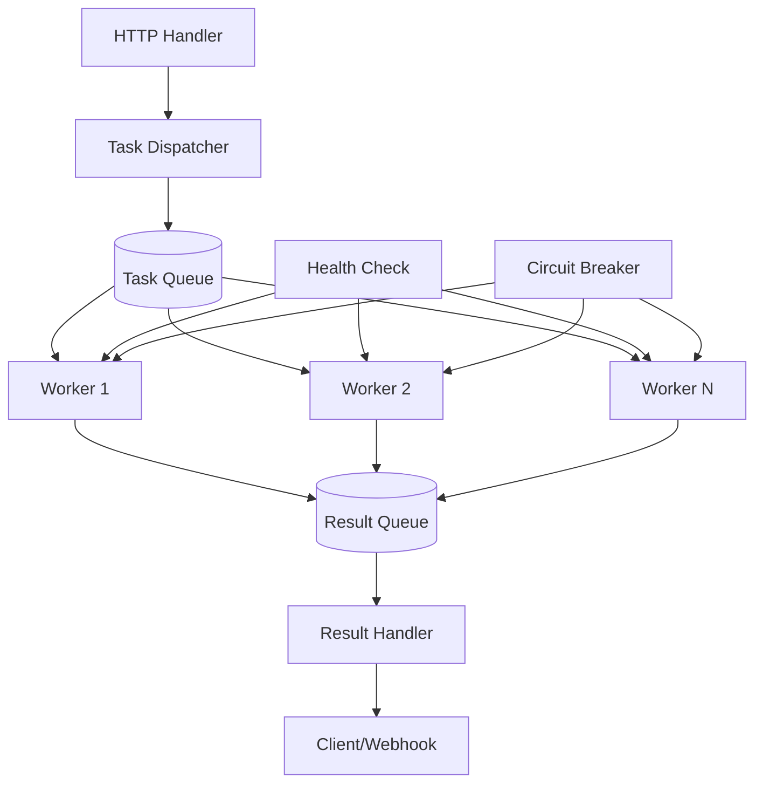

# Best Practices для реализации Worker Pool
## Универсальное руководство по обработке фоновых задач

---

## 1. Фундаментальные проблемы и их решения

### 1.1. Почему просто "горутина на каждую задачу" убивает систему

**Проблема:** В Go `go func()` кажется дешёвой, но 100k горутин сожрут всю память. В Node.js каждый async вызов тоже не бесплатен.

```go
// ПЛОХО - так делать в проде нельзя
func (s *Server) handleRequest(w http.ResponseWriter, r *http.Request) {
    // При 10k RPS создаст 10k горутин -> OOM killer
    go s.processTask(r.Context(), extractTask(r))
    w.WriteHeader(http.StatusAccepted)
}
```

**Почему это плохо:**
- Нет ограничений на параллелизм
- При всплеске нагрузки ляжет БД/Redis
- Нет контроля над очередью
- При падении сервера теряются задачи

**Правильный подход:** Worker pool с ограниченным количеством воркеров и управляемой очередью.

---

## 2. Архитектура production-ready worker pool

### 2.1. Компонентная структура



### 2.2. Базовая реализация с контролем всего

```go
package workerpool

import (
    "context"
    "fmt"
    "sync"
    "sync/atomic"
    "time"
    
    "github.com/prometheus/client_golang/prometheus"
    "go.uber.org/zap"
)

// Task определяет единицу работы
type Task struct {
    ID        string
    Type      string
    Payload   interface{}
    Priority  int // 0-9, чем выше, тем важнее
    CreatedAt time.Time
    MaxRetries int
    Timeout   time.Duration
}

// Result результат выполнения задачи
type Result struct {
    TaskID    string
    Success   bool
    Error     error
    Duration  time.Duration
    Attempt   int
}

// WorkerPool главная структура
type WorkerPool struct {
    // Конфигурация
    numWorkers   int
    queueSize    int
    
    // Каналы для коммуникации
    taskQueue    chan *Task
    resultQueue  chan *Result
    
    // Управление жизненным циклом
    ctx          context.Context
    cancel       context.CancelFunc
    wg           sync.WaitGroup
    
    // Состояние
    activeWorkers int32
    tasksProcessed int64
    tasksFailed    int64
    
    // Зависимости
    logger       *zap.Logger
    metrics      *Metrics
    
    // Защита от перегрузок
    circuitBreaker *CircuitBreaker
    rateLimiter    *RateLimiter
    
    // Graceful shutdown
    shutdownTimeout time.Duration
}

// Metrics для Prometheus
type Metrics struct {
    queueLength     prometheus.Gauge
    activeWorkers   prometheus.Gauge
    taskDuration    *prometheus.HistogramVec
    tasksProcessed  *prometheus.CounterVec
    tasksFailed     *prometheus.CounterVec
    taskRetries     *prometheus.CounterVec
}

func NewWorkerPool(ctx context.Context, numWorkers, queueSize int, logger *zap.Logger) *WorkerPool {
    ctx, cancel := context.WithCancel(ctx)
    
    wp := &WorkerPool{
        numWorkers:      numWorkers,
        queueSize:       queueSize,
        taskQueue:       make(chan *Task, queueSize),
        resultQueue:     make(chan *Result, queueSize),
        ctx:             ctx,
        cancel:          cancel,
        logger:          logger,
        shutdownTimeout: 30 * time.Second,
    }
    
    wp.initMetrics()
    return wp
}

// Start запускает воркеры
func (wp *WorkerPool) Start() {
    wp.logger.Info("starting worker pool", 
        zap.Int("workers", wp.numWorkers),
        zap.Int("queue_size", wp.queueSize))
    
    // Запускаем воркеры
    for i := 0; i < wp.numWorkers; i++ {
        wp.wg.Add(1)
        go wp.worker(i)
    }
    
    // Запускаем обработчик результатов
    wp.wg.Add(1)
    go wp.resultHandler()
    
    // Запускаем мониторинг
    wp.wg.Add(1)
    go wp.monitor()
}

// worker основной цикл обработки задач
func (wp *WorkerPool) worker(id int) {
    defer wp.wg.Done()
    atomic.AddInt32(&wp.activeWorkers, 1)
    defer atomic.AddInt32(&wp.activeWorkers, -1)
    
    wp.logger.Debug("worker started", zap.Int("worker_id", id))
    
    for {
        select {
        case <-wp.ctx.Done():
            wp.logger.Debug("worker stopping", zap.Int("worker_id", id))
            return
            
        case task := <-wp.taskQueue:
            wp.processTaskWithRecover(id, task)
        }
    }
}

// processTaskWithRecover с защитой от паники
func (wp *WorkerPool) processTaskWithRecover(workerID int, task *Task) {
    defer func() {
        if r := recover(); r != nil {
            wp.logger.Error("worker panic recovered",
                zap.Int("worker_id", workerID),
                zap.String("task_id", task.ID),
                zap.Any("panic", r),
                zap.Stack("stack"))
            
            // Отправляем результат с ошибкой
            wp.resultQueue <- &Result{
                TaskID:  task.ID,
                Success: false,
                Error:   fmt.Errorf("panic: %v", r),
            }
        }
    }()
    
    start := time.Now()
    
    // Создаем контекст с таймаутом для задачи
    taskCtx, cancel := context.WithTimeout(wp.ctx, task.Timeout)
    defer cancel()
    
    // Обрабатываем задачу
    err := wp.executeTask(taskCtx, task)
    
    duration := time.Since(start)
    
    // Отправляем результат
    result := &Result{
        TaskID:   task.ID,
        Success:  err == nil,
        Error:    err,
        Duration: duration,
    }
    
    // Не блокируемся на отправке результата
    select {
    case wp.resultQueue <- result:
    default:
        wp.logger.Warn("result queue full, dropping result", 
            zap.String("task_id", task.ID))
    }
    
    // Обновляем метрики
    wp.metrics.taskDuration.WithLabelValues(task.Type).Observe(duration.Seconds())
    atomic.AddInt64(&wp.tasksProcessed, 1)
    if err != nil {
        atomic.AddInt64(&wp.tasksFailed, 1)
    }
}
```

---

## 3. Критические паттерны для продакшена

### 3.1. Graceful Shutdown

```go
// Shutdown останавливает пул с ожиданием текущих задач
func (wp *WorkerPool) Shutdown(ctx context.Context) error {
    wp.logger.Info("shutting down worker pool")
    
    // Сигналим остановку
    wp.cancel()
    
    // Канал для сигнала завершения
    done := make(chan struct{})
    
    go func() {
        // Ждем завершения всех воркеров
        wp.wg.Wait()
        close(done)
    }()
    
    // Ждем либо завершения, либо таймаута
    select {
    case <-done:
        wp.logger.Info("worker pool stopped gracefully")
        return nil
    case <-ctx.Done():
        wp.logger.Warn("worker pool shutdown timeout")
        return ctx.Err()
    }
}

// Использование в main
func main() {
    wp := workerpool.NewWorkerPool(context.Background(), 10, 100, logger)
    wp.Start()
    
    // Ждем сигналов ОС
    sigCh := make(chan os.Signal, 1)
    signal.Notify(sigCh, syscall.SIGINT, syscall.SIGTERM)
    <-sigCh
    
    // Graceful shutdown с таймаутом
    ctx, cancel := context.WithTimeout(context.Background(), 30*time.Second)
    defer cancel()
    
    if err := wp.Shutdown(ctx); err != nil {
        log.Fatal("shutdown failed:", err)
    }
}
```

### 3.2. Приоритезация задач

```go
// PriorityQueue - очередь с приоритетами
type PriorityQueue struct {
    queues   []chan *Task
    mu       sync.RWMutex
    stopped  bool
}

func NewPriorityQueue(levels int, size int) *PriorityQueue {
    pq := &PriorityQueue{
        queues: make([]chan *Task, levels),
    }
    for i := 0; i < levels; i++ {
        pq.queues[i] = make(chan *Task, size)
    }
    return pq
}

// AddTask добавляет задачу с учётом приоритета
func (pq *PriorityQueue) AddTask(task *Task) error {
    pq.mu.RLock()
    defer pq.mu.RUnlock()
    
    if pq.stopped {
        return ErrQueueStopped
    }
    
    // Нормализуем приоритет в диапазон [0, levels-1]
    priority := task.Priority
    if priority < 0 {
        priority = 0
    }
    if priority >= len(pq.queues) {
        priority = len(pq.queues) - 1
    }
    
    select {
    case pq.queues[priority] <- task:
        return nil
    default:
        return ErrQueueFull
    }
}

// GetTask получает задачу с наивысшим приоритетом
func (pq *PriorityQueue) GetTask(ctx context.Context) (*Task, error) {
    for {
        for i := len(pq.queues) - 1; i >= 0; i-- {
            select {
            case task := <-pq.queues[i]:
                return task, nil
            default:
                continue
            }
        }
        
        // Если ничего нет, ждем любую задачу
        select {
        case <-ctx.Done():
            return nil, ctx.Err()
        default:
            time.Sleep(10 * time.Millisecond)
        }
    }
}
```

### 3.3. Retry с экспоненциальной задержкой

```go
type RetryStrategy struct {
    MaxAttempts     int
    InitialInterval time.Duration
    MaxInterval     time.Duration
    Multiplier      float64
    Jitter          float64
}

func DefaultRetryStrategy() *RetryStrategy {
    return &RetryStrategy{
        MaxAttempts:     3,
        InitialInterval: 100 * time.Millisecond,
        MaxInterval:     10 * time.Second,
        Multiplier:      2.0,
        Jitter:          0.1, // 10% jitter
    }
}

func (wp *WorkerPool) executeWithRetry(task *Task) error {
    strategy := DefaultRetryStrategy()
    var lastErr error
    
    for attempt := 0; attempt < strategy.MaxAttempts; attempt++ {
        // Проверяем контекст
        select {
        case <-wp.ctx.Done():
            return wp.ctx.Err()
        default:
        }
        
        // Выполняем задачу
        err := wp.executeTask(wp.ctx, task)
        if err == nil {
            return nil
        }
        
        lastErr = err
        wp.logger.Warn("task failed, will retry",
            zap.String("task_id", task.ID),
            zap.Int("attempt", attempt+1),
            zap.Error(err))
        
        // Считаем retry в метриках
        wp.metrics.taskRetries.WithLabelValues(task.Type).Inc()
        
        if attempt < strategy.MaxAttempts-1 {
            // Рассчитываем задержку с jitter
            delay := strategy.InitialInterval * time.Duration(
                math.Pow(strategy.Multiplier, float64(attempt)))
            if delay > strategy.MaxInterval {
                delay = strategy.MaxInterval
            }
            
            // Добавляем jitter (±10%)
            jitter := time.Duration(float64(delay) * strategy.Jitter * 
                (rand.Float64()*2 - 1))
            delay += jitter
            
            time.Sleep(delay)
        }
    }
    
    return fmt.Errorf("max retries exceeded: %w", lastErr)
}
```

---

## 4. Мониторинг и observability

### 4.1. Health checks

```go
type WorkerPoolHealth struct {
    Status           string        `json:"status"`
    ActiveWorkers    int32         `json:"active_workers"`
    QueueLength      int           `json:"queue_length"`
    QueueCapacity    int           `json:"queue_capacity"`
    TasksProcessed   int64         `json:"tasks_processed"`
    TasksFailed      int64         `json:"tasks_failed"`
    ErrorRate        float64       `json:"error_rate"`
    AvgProcessingTime time.Duration `json:"avg_processing_time"`
}

func (wp *WorkerPool) HealthCheck() *WorkerPoolHealth {
    health := &WorkerPoolHealth{
        ActiveWorkers:  atomic.LoadInt32(&wp.activeWorkers),
        QueueLength:    len(wp.taskQueue),
        QueueCapacity:  cap(wp.taskQueue),
        TasksProcessed: atomic.LoadInt64(&wp.tasksProcessed),
        TasksFailed:    atomic.LoadInt64(&wp.tasksFailed),
    }
    
    // Вычисляем error rate
    if health.TasksProcessed > 0 {
        health.ErrorRate = float64(health.TasksFailed) / 
            float64(health.TasksProcessed)
    }
    
    // Определяем статус
    switch {
    case health.QueueLength > health.QueueCapacity*9/10:
        health.Status = "degraded" // очередь почти полна
    case health.ErrorRate > 0.1:
        health.Status = "degraded" // >10% ошибок
    case health.ActiveWorkers == 0:
        health.Status = "down"
    default:
        health.Status = "healthy"
    }
    
    return health
}

// HTTP handler для k8s probes
func (wp *WorkerPool) LiveHandler(w http.ResponseWriter, r *http.Request) {
    w.WriteHeader(http.StatusOK)
    json.NewEncoder(w).Encode(map[string]string{"status": "alive"})
}

func (wp *WorkerPool) ReadyHandler(w http.ResponseWriter, r *http.Request) {
    health := wp.HealthCheck()
    
    if health.Status == "healthy" {
        w.WriteHeader(http.StatusOK)
    } else {
        w.WriteHeader(http.StatusServiceUnavailable)
    }
    
    json.NewEncoder(w).Encode(health)
}
```

### 4.2. Подробные метрики

```go
func (wp *WorkerPool) initMetrics() {
    wp.metrics = &Metrics{
        queueLength: promauto.NewGauge(prometheus.GaugeOpts{
            Name: "workerpool_queue_length",
            Help: "Current queue length",
        }),
        
        activeWorkers: promauto.NewGauge(prometheus.GaugeOpts{
            Name: "workerpool_active_workers",
            Help: "Number of active workers",
        }),
        
        taskDuration: promauto.NewHistogramVec(
            prometheus.HistogramOpts{
                Name:    "workerpool_task_duration_seconds",
                Help:    "Task processing duration",
                Buckets: prometheus.DefBuckets,
            },
            []string{"task_type"},
        ),
        
        tasksProcessed: promauto.NewCounterVec(
            prometheus.CounterOpts{
                Name: "workerpool_tasks_processed_total",
                Help: "Total tasks processed",
            },
            []string{"task_type", "status"},
        ),
        
        taskRetries: promauto.NewCounterVec(
            prometheus.CounterOpts{
                Name: "workerpool_task_retries_total",
                Help: "Total task retries",
            },
            []string{"task_type"},
        ),
    }
    
    // Регулярное обновление gauges
    go func() {
        ticker := time.NewTicker(5 * time.Second)
        defer ticker.Stop()
        
        for {
            select {
            case <-wp.ctx.Done():
                return
            case <-ticker.C:
                wp.metrics.queueLength.Set(float64(len(wp.taskQueue)))
                wp.metrics.activeWorkers.Set(float64(
                    atomic.LoadInt32(&wp.activeWorkers)))
            }
        }
    }()
}
```

### 4.3. Структурированное логирование

```go
type TaskLog struct {
    Level       string    `json:"level"`
    Timestamp   time.Time `json:"@timestamp"`
    
    TaskID      string    `json:"task_id"`
    TaskType    string    `json:"task_type"`
    Priority    int       `json:"priority"`
    
    Attempt     int       `json:"attempt"`
    Duration    string    `json:"duration_ms"`
    
    WorkerID    int       `json:"worker_id"`
    QueueLength int       `json:"queue_length"`
    
    Error       string    `json:"error,omitempty"`
    StackTrace  string    `json:"stacktrace,omitempty"`
}

func (wp *WorkerPool) logTaskCompletion(task *Task, result *Result, workerID int) {
    logEntry := map[string]interface{}{
        "level":       "info",
        "@timestamp": time.Now(),
        "task_id":     task.ID,
        "task_type":   task.Type,
        "priority":    task.Priority,
        "duration_ms": result.Duration.Milliseconds(),
        "worker_id":   workerID,
        "queue_length": len(wp.taskQueue),
        "success":     result.Success,
    }
    
    if result.Error != nil {
        logEntry["level"] = "error"
        logEntry["error"] = result.Error.Error()
        
        // Логируем stack trace для неожиданных ошибок
        if errors.Is(result.Error, context.DeadlineExceeded) {
            logEntry["stacktrace"] = string(debug.Stack())
        }
    }
    
    // JSON логирование для ELK
    logJSON, _ := json.Marshal(logEntry)
    fmt.Println(string(logJSON))
}
```

---

## 5. Защита от перегрузок (Backpressure)

### 5.1. Circuit Breaker для внешних сервисов

```go
type CircuitBreaker struct {
    mu              sync.RWMutex
    state           string // closed, open, half-open
    failures        int
    threshold       int
    timeout         time.Duration
    lastFailureTime time.Time
}

func (cb *CircuitBreaker) Execute(fn func() error) error {
    // Проверяем состояние
    cb.mu.RLock()
    state := cb.state
    cb.mu.RUnlock()
    
    switch state {
    case "open":
        // Проверяем, не прошло ли время таймаута
        if time.Since(cb.lastFailureTime) > cb.timeout {
            cb.mu.Lock()
            cb.state = "half-open"
            cb.mu.Unlock()
        } else {
            return ErrCircuitOpen
        }
    }
    
    // Пробуем выполнить
    err := fn()
    
    cb.mu.Lock()
    defer cb.mu.Unlock()
    
    if err != nil {
        cb.failures++
        cb.lastFailureTime = time.Now()
        
        if cb.failures >= cb.threshold {
            cb.state = "open"
        }
        return err
    }
    
    // Успех
    if cb.state == "half-open" {
        cb.state = "closed"
        cb.failures = 0
    }
    
    return nil
}
```

### 5.2. Dynamic scaling (если нужно)

```go
type DynamicPool struct {
    *WorkerPool
    minWorkers     int
    maxWorkers     int
    scaleUpFactor  float64 // при заполнении очереди на N%
    scaleDownFactor float64 // при простое воркеров
    monitorInterval time.Duration
}

func (dp *DynamicPool) monitorAndScale() {
    ticker := time.NewTicker(dp.monitorInterval)
    defer ticker.Stop()
    
    for {
        select {
        case <-dp.ctx.Done():
            return
        case <-ticker.C:
            queueLoad := float64(len(dp.taskQueue)) / float64(cap(dp.taskQueue))
            activeWorkers := int(atomic.LoadInt32(&dp.activeWorkers))
            
            switch {
            case queueLoad > dp.scaleUpFactor && activeWorkers < dp.maxWorkers:
                // Нужно больше воркеров
                newWorkers := min(activeWorkers*2, dp.maxWorkers)
                dp.scaleTo(newWorkers)
                
            case queueLoad < 0.1 && activeWorkers > dp.minWorkers:
                // Слишком много воркеров простаивает
                newWorkers := max(activeWorkers/2, dp.minWorkers)
                dp.scaleTo(newWorkers)
            }
        }
    }
}
```

---

## 6. Конфигурация для разных сценариев

### 6.1. Production конфигурация (YAML)

```yaml
worker_pool:
  # Основные параметры
  num_workers: 10          # Начать с 10, регулировать по метрикам
  queue_size: 1000         # Максимум задач в очереди
  
  # Стратегия обработки
  processing_strategy: "parallel"  # parallel или sequential
  
  # Поведение при полной очереди
  queue_full_policy: "reject"  # reject, wait, or drop_oldest
  
  # Приоритезация
  priority_levels: 5
  priority_default: 2
  
  # Таймауты
  task_timeout: "30s"
  shutdown_timeout: "30s"
  
  # Retry политика
  retry:
    max_attempts: 3
    initial_interval: "100ms"
    max_interval: "10s"
    multiplier: 2.0
    jitter: 0.1
  
  # Rate limiting для задач
  rate_limit:
    enabled: true
    tasks_per_second: 100
    burst: 20
  
  # Circuit breaker для внешних вызовов
  circuit_breaker:
    enabled: true
    failure_threshold: 5
    timeout: "10s"
  
  # Мониторинг
  health_check_interval: "10s"
  metrics_enabled: true
  tracing_enabled: true
  
  # Логирование
  log_level: "info"
  log_slow_tasks_threshold: "5s"
```

### 6.2. Feature flags для A/B тестирования

```go
type WorkerPoolConfig struct {
    // Включение новых фич
    EnablePriorityQueue   bool `feature:"priority-queue"`
    EnableDynamicScaling  bool `feature:"dynamic-scaling"`
    EnableCircuitBreaker  bool `feature:"circuit-breaker"`
    
    // Постепенное включение
    CanaryPercent        int    `feature:"new-worker-pool"`
    CanaryTaskTypes      []string // Только для определенных типов задач
    
    // Динамические параметры
    WorkersByHour        map[int]int // Разное кол-во воркеров по часам
    QueueSizeByLoad      map[string]int // Размер очереди в зависимости от нагрузки
}
```

---

## 7. Тестирование

### 7.1. Нагрузочное тестирование

```go
func TestWorkerPoolUnderLoad(t *testing.T) {
    pool := NewWorkerPool(context.Background(), 10, 100, logger)
    pool.Start()
    
    // Генерируем нагрузку
    const numTasks = 10000
    var wg sync.WaitGroup
    
    start := time.Now()
    
    for i := 0; i < numTasks; i++ {
        wg.Add(1)
        go func(id int) {
            defer wg.Done()
            
            task := &Task{
                ID:        fmt.Sprintf("task-%d", id),
                Type:      "test",
                Payload:   id,
                CreatedAt: time.Now(),
            }
            
            err := pool.Submit(task)
            if err != nil {
                t.Logf("submit error: %v", err)
            }
        }(i)
    }
    
    wg.Wait()
    
    // Ждем завершения обработки
    time.Sleep(5 * time.Second)
    
    duration := time.Since(start)
    t.Logf("Processed %d tasks in %v", numTasks, duration)
    t.Logf("Throughput: %.2f tasks/sec", float64(numTasks)/duration.Seconds())
    
    // Проверяем метрики
    health := pool.HealthCheck()
    if health.TasksFailed > 0 {
        t.Errorf("%d tasks failed", health.TasksFailed)
    }
}
```

### 7.2. Тесты на граничные случаи

```go
func TestWorkerPoolEdgeCases(t *testing.T) {
    t.Run("queue full rejection", func(t *testing.T) {
        pool := NewWorkerPool(context.Background(), 1, 5, logger)
        pool.Start()
        
        // Заполняем очередь
        for i := 0; i < 10; i++ {
            err := pool.Submit(&Task{ID: fmt.Sprintf("task-%d", i)})
            if i < 5 && err != nil {
                t.Errorf("expected nil, got %v", err)
            }
            if i >= 5 && err != ErrQueueFull {
                t.Errorf("expected ErrQueueFull, got %v", err)
            }
        }
    })
    
    t.Run("worker panic recovery", func(t *testing.T) {
        pool := NewWorkerPool(context.Background(), 1, 5, logger)
        pool.Start()
        
        // Задача, которая паникует
        err := pool.Submit(&Task{
            ID: "panic-task",
            Payload: func() {
                panic("test panic")
            },
        })
        
        if err != nil {
            t.Fatal(err)
        }
        
        // Ждем обработки
        time.Sleep(100 * time.Millisecond)
        
        // Проверяем, что воркер жив
        health := pool.HealthCheck()
        if health.ActiveWorkers != 1 {
            t.Errorf("worker died after panic")
        }
    })
}
```

---

## 8. Чек-лист для продакшена

### ✅ Must have (критично)
- [ ] Ограничение на количество параллельных задач (worker pool)
- [ ] Graceful shutdown с ожиданием текущих задач
- [ ] Защита от паники в воркерах (recover)
- [ ] Таймауты на выполнение задач
- [ ] Очередь с ограниченным размером
- [ ] Метрики в Prometheus (активные воркеры, длина очереди, время выполнения)
- [ ] Health checks для k8s
- [ ] Логирование всех ошибок

### ⚠️ Should have (для надежности)
- [ ] Retry с экспоненциальной задержкой
- [ ] Circuit breaker для внешних сервисов
- [ ] Rate limiting на поступление задач
- [ ] Приоритезация задач
- [ ] Метрики по типам задач
- [ ] Мониторинг slow tasks
- [ ] Graceful degradation при переполнении очереди

### 🚀 Nice to have (для высоких нагрузок)
- [ ] Dynamic scaling количества воркеров
- [ ] Персистентная очередь (Redis/Kafka) для durability
- [ ] Распределенный worker pool на несколько инстансов
- [ ] Изоляция задач по пулам (CPU-bound vs I/O-bound)
- [ ] Tracing запросов через worker pool
- [ ] Автоматическая настройка параметров на основе нагрузки

---

## Заключение

Worker pool — это не просто "пул горутин", а критический компонент production системы. Ключевые принципы:

1. **Always bound resources** — никогда не позволяйте задачам потреблять бесконечные ресурсы
2. **Fail gracefully** — при перегрузке отказывайте, но не падайте
3. **Observe everything** — без метрик вы слепы
4. **Test the failure modes** — паника в задаче не должна убивать воркер
5. **Shutdown gracefully** — терять задачи в проде нельзя
