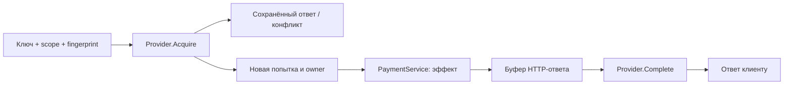

# 04. Идемпотентность: повтор запроса и границы эффекта

**Материалы для разбора:** [статьи EN/RU и реальные проекты](../docs/reading-map-01-30.md#task-04) · [оценка постановки](../docs/quality-review-01-30.md) · [связи с EventLab](../docs/project-playground-01-107.md).

Исследуем, как связаны ключ операции, конкурентное выполнение, сохранённый HTTP-ответ и бизнес-эффект. Реализованы четыре переключаемых варианта на Go. Учебный «платёж» записывается в ограниченный журнал памяти; реального списания денег и долговечного банковского ledger здесь нет.

## Что сравниваем

| `-provider` | Где хранится состояние | Повтор до окончания lease | Истёкший незавершённый запрос |
|---|---|---|---|
| `noop` | Нигде | Снова выполняется | Снова выполняется: baseline без защиты |
| `memory` | Один процесс, mutex | `409 in_progress` | `409 outcome_unknown`, автоматического повторного исполнения нет |
| `redis` | Общий Redis, `SET NX`, TTL, `WATCH` | `409 in_progress` | Ключ исчезает; новая попытка может повторить эффект |
| `advanced` | Общий Redis, Lua, owner и lease | `409 in_progress` | Запись остаётся, `409 outcome_unknown`, автоматического перехвата нет |

В последних трёх вариантах завершённая запись возвращает сохранённые статус, тело и разрешённые заголовки до `result-ttl`. Иное тело с тем же ключом даёт `409 key_mismatch`, пока запись существует. После удаления записи или окончания retention ключ снова может быть принят как новый.

**Owner защищает запись результата в хранилище. Он не делает внешний эффект атомарным с этой записью.** В `memory` и `advanced` неизвестный исход блокирует автоматический повтор ценой доступности. Устойчивость к потере Redis, eviction, failover и рестартам не доказана этими опытами.

## Быстрый запуск

Нужен Go версии из [go.mod](go/go.mod); Docker Compose нужен только для Redis-вариантов. Команды ниже выполняются из `04-idempotency`.

```sh
make test
make run                         # memory, 127.0.0.1:8084
```

В другом терминале отправить один и тот же запрос дважды:

```sh
curl -i http://127.0.0.1:8084/api/v1/payments \
  -H 'Content-Type: application/json' \
  -H 'Idempotency-Key: payment-001' \
  -d '{"from":"alice","to":"bob","amount":100}'

curl -i http://127.0.0.1:8084/api/v1/payments \
  -H 'Content-Type: application/json' \
  -H 'Idempotency-Key: payment-001' \
  -d '{"from":"alice","to":"bob","amount":100}'

curl http://127.0.0.1:8084/api/v1/effects
curl http://127.0.0.1:8084/metrics
```

Ожидается один эффект и одинаковый ответ. `amount` — положительное целое число минимальных денежных единиц. Поменять `amount`, сохранив ключ: ожидается конфликт. Даже изменение пробелов JSON меняет fingerprint: сравниваются исходные байты, канонизации нет. В fingerprint также входят конкретный URL path и исходный query; их изменение в рамках того же scope/key даёт конфликт.

Redis-вариант:

```sh
make redis-up                    # отдельный Compose-проект, Redis на 127.0.0.1:6384
make run PROVIDER=advanced
make test-integration            # реальные Redis-проверки с -race
make experiment                  # сравнительные опыты, включая число эффектов
make redis-down                  # останавливает стенд, сохраняет volume
```

Перед сменой варианта остановить предыдущий сервер. Для независимых ручных опытов задавать новый `-redis-prefix`; у реплик одного опыта prefix должен совпадать. Сохранённые Redis-ответы переживают перезапуск приложения, а учебный журнал — нет, поэтому после рестарта его счётчик не отражает прошлые эффекты.

Можно использовать уже запущенный **учебный** Redis: `make experiment LAB_REDIS_ADDR=127.0.0.1:16384`. Тесты создают собственные пространства ключей и удаляют только их. Без `LAB_REDIS_ADDR` обычный `go test` пропускает Redis-сценарии; `make test-integration` задаёт адрес и требует доступности Redis.

## Один запрос по шагам



1. [HTTP middleware](go/pkg/idempotency/http.go) проверяет ключ и размер тела. Scope включает метод, маршрут и учебный tenant; конкретный path, query и исходные байты тела образуют SHA-256 fingerprint.
2. [Provider](go/pkg/idempotency/provider.go) атомарно решает, кто владеет попыткой, кому вернуть replay и кому отказать.
3. [HTTP handler](go/internal/adapter/inbound/http/handlers/payment.go) разбирает JSON; [сервис](go/internal/usecase/payment.go) проверяет команду и добавляет отдельный эффект.
4. Middleware буферизует ответ и вызывает `Complete` с ограниченным контекстом, независимым от отмены клиента. До успешного сохранения результат не отправляется как успех.
5. Если эффект выполнен, но завершение не сохранилось, клиент получает `outcome_unknown`. Новый ключ не является способом безопасно «повторить платёж».

Общие JSON-ответы уже берутся из [`labshared/httpx`](../shared/go/httpx/response.go). Идемпотентность пока остаётся внутри задачи: вынос в общий пакет имеет смысл после появления второго потребителя с тем же контрактом.

## Контракт и ограничения

- `POST /api/v1/payments` требует один `Idempotency-Key` длиной 1–128 видимых ASCII-символов. `X-Demo-Tenant` показывает разделение пространства ключей; это не аутентификация.
- `GET /api/v1/effects` возвращает `{count,payments}`; журнал каждой реплики отдельный. `GET /metrics` содержит фиксированные labels без ключей и тел запросов. `GET /healthz` проверяет доступность Redis для соответствующих вариантов.
- Сохраняется любой завершённый ответ handler, включая ошибки `400`, `408` и `503`. Повтор с тем же ключом воспроизводит его до retention. Ошибки до захвата ключа не кэшируются. Автоматической политики повторов после временных ошибок нет.
- Replay поддерживает тело, статус, `Content-Type` и `Location`. Streaming, cookies и произвольные заголовки в контракт не входят.
- `lease-ttl` ограничивает срок владения, `result-ttl` — окно хранения ответа после завершения. Ни один срок сам по себе не прекращает уже запущенный эффект.
- `memory` теряет ключи при рестарте и не разделяет их между репликами. Его ёмкость ограничена `max-entries`; неизвестные исходы не вытесняются ради новых запросов.
- В `advanced` pending-записи не имеют TTL и требуют сверки исхода. Автоматической сверки в задаче нет. Нельзя очищать их вслепую: это может разрешить повтор эффекта. При накоплении таких записей потребуется отдельная политика восстановления и ёмкости.
- Compose использует `noeviction`, лимит Redis 128 MiB и AOF `everysec`. Это условия стенда, не гарантия сохранения каждого результата при отказе. Неизвестные записи могут заполнить хранилище; нехватка памяти возвращается как недоступность.
- Журнал платежей ограничен `max-entries` и хранится в памяти. Отдельная транзакция между ним и Redis отсутствует. Это стенд для изучения разрыва, не реализация платёжной системы.

Полный список настроек: `cd go && go run ./cmd/server -h`. Для воспроизведения expiry задать `-lease-ttl=10ms -payment-delay=100ms`: операция переживёт владение. Предсказание и наблюдение записать отдельно.

## Проверки и разбор

- [Записная книжка с фактическими результатами](docs/experiment-notes.md).
- [Краткая спецификация](docs/spec/specification.ru.md) и [границы стратегий](docs/strategies-overview.md).
- [Пошаговое чтение кода и вопросы](docs/lectures/lectures_1.md).
- [Общие правила лаборатории](../CONTRIBUTING.md) и [карта Go](../docs/go-learning-map.md): GO-02, GO-03, GO-04, GO-05, GO-10, GO-11.

Следующий самостоятельный опыт: хранить ключ операции, эффект и результат в одной транзакции БД; прервать процесс после commit, до ответа клиенту. Затем сравнить это с внешним сервисом, который поддерживает собственный idempotency key. Это разные границы согласования.
