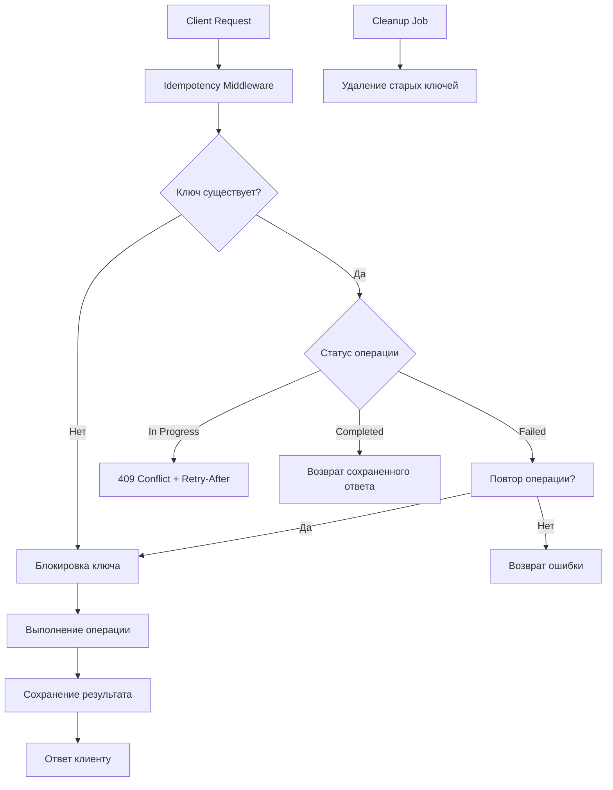

# Best Practices для реализации Idempotency Key Provider
## Универсальное руководство по гарантии exactly-once выполнения операций

---

## 1. Фундаментальные проблемы и их решения

### 1.1. Почему это критично для production

**Проблема:** В распределенных системах клиенты могут повторять запросы из-за таймаутов, сетевых ошибок или пользовательских действий. Без идемпотентности:
- Платежи списываются дважды
- Создаются дубликаты заказов
- Начисляются бонусы несколько раз
- Отправляются дубликаты email

```go
// ПЛОХО - так делать в проде нельзя
func (s *Server) ProcessPayment(w http.ResponseWriter, r *http.Request) {
    var req PaymentRequest
    if err := json.NewDecoder(r.Body).Decode(&req); err != nil {
        w.WriteHeader(http.StatusBadRequest)
        return
    }
    
    // Если клиент повторит запрос - спишем деньги дважды!
    payment, err := s.paymentService.Charge(req.UserID, req.Amount)
    if err != nil {
        w.WriteHeader(http.StatusInternalServerError)
        return
    }
    
    json.NewEncoder(w).Encode(payment)
}
```

**Правильный подход:** Идемпотентность гарантирует, что повторные запросы с одним и тем же ключом не приведут к повторному выполнению операции.

---

## 2. Архитектура production-ready idempotency provider

### 2.1. Компонентная структура



### 2.2. Базовая реализация с полным контролем

```go
package idempotency

import (
    "context"
    "crypto/sha256"
    "encoding/base64"
    "encoding/json"
    "fmt"
    "sync"
    "time"
    
    "github.com/go-redis/redis/v8"
    "github.com/google/uuid"
    "go.uber.org/zap"
)

// IdempotencyKey уникальный ключ запроса
type IdempotencyKey string

// IdempotencyRecord хранит состояние и результат операции
type IdempotencyRecord struct {
    // Метаданные
    Key          string        `json:"key"`
    CreatedAt    time.Time     `json:"created_at"`
    UpdatedAt    time.Time     `json:"updated_at"`
    
    // Состояние
    Status       Status        `json:"status"` // pending, completed, failed
    
    // Результат
    ResponseCode int           `json:"response_code,omitempty"`
    ResponseBody json.RawMessage `json:"response_body,omitempty"`
    ResponseHeaders map[string]string `json:"response_headers,omitempty"`
    
    // Ошибка если была
    Error        string        `json:"error,omitempty"`
    
    // Для блокировок
    LockID       string        `json:"lock_id,omitempty"`
    LockExpiresAt time.Time    `json:"lock_expires_at,omitempty"`
}

type Status string

const (
    StatusPending   Status = "pending"
    StatusCompleted Status = "completed"
    StatusFailed    Status = "failed"
)

// IdempotencyProvider главный интерфейс
type IdempotencyProvider interface {
    // GetOrCreate получает существующую запись или создает новую
    GetOrCreate(ctx context.Context, key IdempotencyKey, ttl time.Duration) (*IdempotencyRecord, bool, error)
    
    // Complete отмечает операцию как успешно завершенную
    Complete(ctx context.Context, key IdempotencyKey, response *Response) error
    
    // Fail отмечает операцию как неудавшуюся
    Fail(ctx context.Context, key IdempotencyKey, err error) error
    
    // Get возвращает запись по ключу
    Get(ctx context.Context, key IdempotencyKey) (*IdempotencyRecord, error)
    
    // Cleanup удаляет старые записи
    Cleanup(ctx context.Context, olderThan time.Duration) (int64, error)
}

// Response стандартизированный ответ
type Response struct {
    StatusCode int
    Headers    map[string]string
    Body       []byte
}

// RedisProvider реализация на Redis
type RedisProvider struct {
    client     *redis.Client
    logger     *zap.Logger
    keyPrefix  string
    lockTTL    time.Duration
    mu         sync.Mutex
}

func NewRedisProvider(client *redis.Client, logger *zap.Logger) *RedisProvider {
    return &RedisProvider{
        client:    client,
        logger:    logger,
        keyPrefix: "idempotency:",
        lockTTL:   5 * time.Second, // Максимальное время выполнения операции
    }
}

// GetOrCreate с атомарной блокировкой через Redis
func (p *RedisProvider) GetOrCreate(ctx context.Context, key IdempotencyKey, ttl time.Duration) (*IdempotencyRecord, bool, error) {
    redisKey := p.buildKey(key)
    
    // Пытаемся создать запись через SET NX
    now := time.Now()
    record := &IdempotencyRecord{
        Key:       string(key),
        CreatedAt: now,
        UpdatedAt: now,
        Status:    StatusPending,
        LockID:    uuid.New().String(),
        LockExpiresAt: now.Add(p.lockTTL),
    }
    
    data, err := json.Marshal(record)
    if err != nil {
        return nil, false, fmt.Errorf("marshal record: %w", err)
    }
    
    // SET NX - создает только если ключа нет
    success, err := p.client.SetNX(ctx, redisKey, data, ttl).Result()
    if err != nil {
        return nil, false, fmt.Errorf("redis set nx: %w", err)
    }
    
    if success {
        // Мы создали новую запись - первый запрос
        p.logger.Debug("created new idempotency record", 
            zap.String("key", string(key)),
            zap.String("lock_id", record.LockID))
        return record, true, nil
    }
    
    // Ключ уже существует - получаем существующую запись
    return p.Get(ctx, key)
}

// Complete атомарно обновляет запись с результатом
func (p *RedisProvider) Complete(ctx context.Context, key IdempotencyKey, response *Response) error {
    redisKey := p.buildKey(key)
    
    // Используем Lua скрипт для атомарного обновления
    script := `
        local key = KEYS[1]
        local data = cjson.decode(ARGV[1])
        local ttl = tonumber(ARGV[2])
        
        local current = redis.call('GET', key)
        if not current then
            return redis.error_reply('record not found')
        end
        
        local record = cjson.decode(current)
        record.status = data.status
        record.response_code = data.response_code
        record.response_body = data.response_body
        record.updated_at = data.updated_at
        
        redis.call('SET', key, cjson.encode(record), 'EX', ttl)
        return redis.status_reply('OK')
    `
    
    record := map[string]interface{}{
        "status":         StatusCompleted,
        "response_code":  response.StatusCode,
        "response_body":  string(response.Body),
        "updated_at":     time.Now(),
    }
    
    data, _ := json.Marshal(record)
    
    err := p.client.Eval(ctx, script, []string{redisKey}, data, int(ttl.Seconds())).Err()
    if err != nil {
        return fmt.Errorf("complete record: %w", err)
    }
    
    p.logger.Debug("completed idempotency record", 
        zap.String("key", string(key)),
        zap.Int("status_code", response.StatusCode))
    
    return nil
}
```

---

## 3. Критические паттерны для продакшена

### 3.1. Idempotency Middleware

```go
type IdempotencyMiddleware struct {
    provider IdempotencyProvider
    logger   *zap.Logger
    // Настройки по умолчанию
    defaultTTL      time.Duration
    headerName      string
    retryAfter      int // секунд для 409
}

func NewIdempotencyMiddleware(provider IdempotencyProvider, logger *zap.Logger) *IdempotencyMiddleware {
    return &IdempotencyMiddleware{
        provider:    provider,
        logger:      logger,
        defaultTTL:  24 * time.Hour,
        headerName:  "Idempotency-Key",
        retryAfter:  5,
    }
}

func (m *IdempotencyMiddleware) Handler(next http.Handler) http.Handler {
    return http.HandlerFunc(func(w http.ResponseWriter, r *http.Request) {
        // 1. Извлекаем ключ
        key := r.Header.Get(m.headerName)
        if key == "" {
            // Для GET запросов идемпотентность не обязательна
            if r.Method == http.MethodGet || r.Method == http.MethodHead {
                next.ServeHTTP(w, r)
                return
            }
            
            // Для modifying методов ключ обязателен
            m.writeError(w, http.StatusBadRequest, "Idempotency-Key header required")
            return
        }
        
        // 2. Валидируем ключ
        if !m.isValidKey(key) {
            m.writeError(w, http.StatusBadRequest, "Invalid Idempotency-Key format")
            return
        }
        
        // 3. Получаем или создаем запись
        record, created, err := m.provider.GetOrCreate(r.Context(), IdempotencyKey(key), m.defaultTTL)
        if err != nil {
            m.logger.Error("failed to get idempotency record", 
                zap.String("key", key),
                zap.Error(err))
            m.writeError(w, http.StatusInternalServerError, "Internal server error")
            return
        }
        
        // 4. Обрабатываем в зависимости от статуса
        switch record.Status {
        case StatusPending:
            // Первый запрос или в процессе
            if created {
                // Мы создали запись - выполняем запрос
                m.processRequest(w, r, next, key, record)
            } else {
                // Кто-то уже обрабатывает этот ключ
                w.Header().Set("Retry-After", fmt.Sprintf("%d", m.retryAfter))
                m.writeError(w, http.StatusConflict, "Request with this key is already being processed")
            }
            
        case StatusCompleted:
            // Запрос уже выполнен - возвращаем кэшированный ответ
            m.writeCachedResponse(w, record)
            
        case StatusFailed:
            // Предыдущая попытка провалилась
            // Можем либо повторить, либо вернуть ошибку
            if m.shouldRetry(record) {
                // Повторяем с новым lock
                m.processRequest(w, r, next, key, record)
            } else {
                m.writeError(w, http.StatusInternalServerError, record.Error)
            }
        }
    })
}

func (m *IdempotencyMiddleware) processRequest(w http.ResponseWriter, r *http.Request, next http.Handler, key string, record *IdempotencyRecord) {
    // Создаем response writer для перехвата ответа
    rw := newResponseRecorder(w)
    
    // Выполняем запрос
    next.ServeHTTP(rw, r)
    
    // Сохраняем результат
    response := &Response{
        StatusCode: rw.statusCode,
        Headers:    rw.headers,
        Body:       rw.body.Bytes(),
    }
    
    var err error
    if rw.statusCode >= 200 && rw.statusCode < 300 {
        err = m.provider.Complete(r.Context(), IdempotencyKey(key), response)
    } else {
        err = m.provider.Fail(r.Context(), IdempotencyKey(key), fmt.Errorf("request failed with status %d", rw.statusCode))
    }
    
    if err != nil {
        m.logger.Error("failed to save idempotency result", 
            zap.String("key", key),
            zap.Error(err))
    }
    
    // Отправляем ответ клиенту
    rw.writeTo(w)
}
```

### 3.2. Response Recorder для кэширования ответов

```go
type responseRecorder struct {
    http.ResponseWriter
    statusCode int
    headers    map[string]string
    body       bytes.Buffer
}

func newResponseRecorder(w http.ResponseWriter) *responseRecorder {
    return &responseRecorder{
        ResponseWriter: w,
        statusCode:     http.StatusOK,
        headers:        make(map[string]string),
    }
}

func (r *responseRecorder) WriteHeader(code int) {
    r.statusCode = code
    // Копируем заголовки
    for k, v := range r.Header() {
        if len(v) > 0 {
            r.headers[k] = v[0]
        }
    }
}

func (r *responseRecorder) Write(b []byte) (int, error) {
    r.body.Write(b)
    return len(b), nil
}

func (r *responseRecorder) writeTo(w http.ResponseWriter) {
    // Копируем заголовки
    for k, v := range r.headers {
        w.Header().Set(k, v)
    }
    
    w.WriteHeader(r.statusCode)
    w.Write(r.body.Bytes())
}
```

### 3.3. Генерация и валидация ключей

```go
// GenerateKey создает безопасный ключ идемпотентности
func GenerateKey() string {
    return uuid.New().String()
}

// GenerateKeyFromRequest создает ключ на основе данных запроса
func GenerateKeyFromRequest(method, path string, body []byte, userID string) string {
    h := sha256.New()
    h.Write([]byte(method))
    h.Write([]byte(path))
    h.Write(body)
    h.Write([]byte(userID))
    
    return base64.URLEncoding.EncodeToString(h.Sum(nil))[:32]
}

func (m *IdempotencyMiddleware) isValidKey(key string) bool {
    // Минимальные требования
    if len(key) < 8 || len(key) > 128 {
        return false
    }
    
    // Только разрешенные символы
    for _, c := range key {
        if !(c >= 'a' && c <= 'z') &&
           !(c >= 'A' && c <= 'Z') &&
           !(c >= '0' && c <= '9') &&
           c != '-' && c != '_' && c != '.' {
            return false
        }
    }
    
    return true
}
```

---

## 4. Redis Lua скрипты для атомарности

### 4.1. GetOrCreate с блокировкой

```lua
-- KEYS[1] = ключ идемпотентности
-- ARGV[1] = данные записи (JSON)
-- ARGV[2] = TTL в секундах
-- ARGV[3] = таймаут блокировки в секундах

local key = KEYS[1]
local record_data = ARGV[1]
local ttl = tonumber(ARGV[2])
local lock_timeout = tonumber(ARGV[3])

-- Пытаемся создать новую запись
local created = redis.call('SET', key, record_data, 'NX', 'EX', ttl)
if created then
    -- Успешно создали, возвращаем с флагом created=true
    return {cjson.decode(record_data), true}
end

-- Запись существует, получаем её
local existing = redis.call('GET', key)
if not existing then
    return redis.error_reply('unexpected: key disappeared')
end

local record = cjson.decode(existing)
local now = tonumber(ARGV[4]) or redis.call('TIME')[1]

-- Проверяем блокировку
if record.status == 'pending' then
    if record.lock_expires_at and record.lock_expires_at > now then
        -- Запись заблокирована другим процессом
        return {record, false, 'locked'}
    else
        -- Блокировка истекла, можем забрать себе
        record.lock_id = ARGV[5]  -- новый lock_id
        record.lock_expires_at = now + lock_timeout
        record.updated_at = now
        
        redis.call('SET', key, cjson.encode(record), 'EX', ttl)
        return {record, true, 'relocked'}
    end
end

-- Запись уже завершена или провалилась
return {record, false, record.status}
```

### 4.2. Атомарное завершение с проверкой владельца

```lua
-- KEYS[1] = ключ идемпотентности
-- ARGV[1] = результат (JSON)
-- ARGV[2] = lock_id владельца
-- ARGV[3] = новый TTL

local key = KEYS[1]
local result_data = ARGV[1]
local lock_id = ARGV[2]
local ttl = tonumber(ARGV[3])

local existing = redis.call('GET', key)
if not existing then
    return redis.error_reply('record not found')
end

local record = cjson.decode(existing)

-- Проверяем, что мы владеем блокировкой
if record.lock_id ~= lock_id then
    return redis.error_reply('lock ownership violation')
end

-- Обновляем запись
local result = cjson.decode(result_data)
record.status = result.status
record.response_code = result.response_code
record.response_body = result.response_body
record.updated_at = result.updated_at
record.lock_id = nil  -- снимаем блокировку
record.lock_expires_at = nil

redis.call('SET', key, cjson.encode(record), 'EX', ttl)
return redis.status_reply('OK')
```

---

## 5. Мониторинг и observability

### 5.1. Метрики для Prometheus

```go
type IdempotencyMetrics struct {
    // Счетчики операций
    requestsTotal   *prometheus.CounterVec
    cacheHits       *prometheus.CounterVec
    conflictsTotal  *prometheus.CounterVec
    
    // Время выполнения
    operationDuration *prometheus.HistogramVec
    
    // Размер кэша
    cacheSize       prometheus.Gauge
    
    // Ошибки
    errorsTotal     *prometheus.CounterVec
}

func InitMetrics() *IdempotencyMetrics {
    m := &IdempotencyMetrics{
        requestsTotal: promauto.NewCounterVec(
            prometheus.CounterOpts{
                Name: "idempotency_requests_total",
                Help: "Total idempotency requests",
            },
            []string{"status"}, // first, cached, conflict, error
        ),
        
        cacheHits: promauto.NewCounterVec(
            prometheus.CounterOpts{
                Name: "idempotency_cache_hits_total",
                Help: "Idempotency cache hits",
            },
            []string{"endpoint"},
        ),
        
        conflictsTotal: promauto.NewCounterVec(
            prometheus.CounterOpts{
                Name: "idempotency_conflicts_total",
                Help: "Idempotency key conflicts",
            },
            []string{"endpoint"},
        ),
        
        operationDuration: promauto.NewHistogramVec(
            prometheus.HistogramOpts{
                Name:    "idempotency_operation_duration_seconds",
                Help:    "Idempotency operation duration",
                Buckets: prometheus.DefBuckets,
            },
            []string{"operation"}, // get_or_create, complete, fail
        ),
        
        errorsTotal: promauto.NewCounterVec(
            prometheus.CounterOpts{
                Name: "idempotency_errors_total",
                Help: "Idempotency errors",
            },
            []string{"type"}, // redis, validation, internal
        ),
    }
    
    return m
}
```

### 5.2. Структурированное логирование

```go
type IdempotencyLog struct {
    Level       string    `json:"level"`
    Timestamp   time.Time `json:"@timestamp"`
    
    // Ключ
    Key         string    `json:"idempotency_key"`
    
    // Операция
    Operation   string    `json:"operation"` // get_or_create, complete, fail
    
    // Результат
    Status      string    `json:"status"`
    Created     bool      `json:"created,omitempty"`
    Cached      bool      `json:"cached,omitempty"`
    
    // Контекст запроса
    Method      string    `json:"method"`
    Path        string    `json:"path"`
    UserID      string    `json:"user_id,omitempty"`
    
    // Временные метрики
    Duration    string    `json:"duration_ms"`
    
    // Ошибки
    Error       string    `json:"error,omitempty"`
    
    // Метаданные
    RequestID   string    `json:"request_id"`
}

func (p *RedisProvider) logOperation(ctx context.Context, op string, key IdempotencyKey, err error, duration time.Duration) {
    log := &IdempotencyLog{
        Level:       "info",
        Timestamp:   time.Now(),
        Key:         string(key),
        Operation:   op,
        Duration:    fmt.Sprintf("%d", duration.Milliseconds()),
        RequestID:   getRequestID(ctx),
    }
    
    if err != nil {
        log.Level = "error"
        log.Error = err.Error()
    }
    
    // JSON для ELK
    data, _ := json.Marshal(log)
    fmt.Println(string(data))
}
```

---

## 6. Обработка граничных случаев

### 6.1. Истечение блокировок (Lock Expiry)

```go
func (p *RedisProvider) handleStuckLocks(ctx context.Context) {
    ticker := time.NewTicker(1 * time.Minute)
    defer ticker.Stop()
    
    for {
        select {
        case <-ctx.Done():
            return
        case <-ticker.C:
            // Ищем записи в статусе pending с истекшими блокировками
            pattern := p.keyPrefix + "*"
            iter := p.client.Scan(ctx, 0, pattern, 100).Iterator()
            
            for iter.Next(ctx) {
                key := iter.Val()
                p.checkAndReleaseLock(ctx, key)
            }
        }
    }
}

func (p *RedisProvider) checkAndReleaseLock(ctx context.Context, key string) {
    script := `
        local key = KEYS[1]
        local now = tonumber(ARGV[1])
        
        local data = redis.call('GET', key)
        if not data then
            return
        end
        
        local record = cjson.decode(data)
        if record.status == 'pending' and record.lock_expires_at and record.lock_expires_at < now then
            -- Блокировка истекла, можно сбросить статус для retry
            record.lock_id = nil
            record.lock_expires_at = nil
            redis.call('SET', key, cjson.encode(record), 'EX', record.ttl)
            return 1
        end
        
        return 0
    `
    
    p.client.Eval(ctx, script, []string{key}, time.Now().Unix()).Result()
}
```

### 6.2. Частичные ответы и streaming

```go
// Для streaming ответов нужно особое обращение
type StreamingResponse struct {
    writer     http.ResponseWriter
    flush      http.Flusher
    record     *IdempotencyRecord
    collected  bytes.Buffer
}

func (sr *StreamingResponse) Write(b []byte) (int, error) {
    // Сохраняем для кэша
    sr.collected.Write(b)
    
    // Но сразу отправляем клиенту
    n, err := sr.writer.Write(b)
    if err == nil && sr.flush != nil {
        sr.flush.Flush()
    }
    return n, err
}

// После завершения сохраняем весь собранный ответ
func (sr *StreamingResponse) Complete(ctx context.Context, provider IdempotencyProvider, key IdempotencyKey) error {
    response := &Response{
        StatusCode: http.StatusOK,
        Body:       sr.collected.Bytes(),
    }
    
    return provider.Complete(ctx, key, response)
}
```

---

## 7. Конфигурация для разных сценариев

### 7.1. Production конфигурация

```yaml
idempotency:
  # Основные настройки
  enabled: true
  default_ttl: "24h"
  key_prefix: "prod:idempotency:"
  
  # Формат ключа
  key_generation: "client_provided"  # или "request_hash"
  key_validation:
    min_length: 8
    max_length: 128
    allowed_chars: "a-zA-Z0-9-_."
  
  # Redis
  redis:
    addresses: ["redis-cluster:6379"]
    cluster_mode: true
    max_retries: 3
    pool_size: 100
  
  # Блокировки
  lock:
    ttl: "5s"           # Максимальное время выполнения операции
    retry_after: "5s"   # Retry-After для 409
  
  # Обработка ошибок
  retry_failed: true
  max_failed_retries: 3
  
  # Очистка
  cleanup:
    enabled: true
    interval: "1h"
    older_than: "48h"
  
  # Мониторинг
  metrics:
    enabled: true
    namespace: "payments"
  
  # Feature flags
  features:
    enable_strict_mode: false
    enable_request_hashing: true
```

### 7.2. Разные стратегии для разных endpoint'ов

```go
type EndpointConfig struct {
    // Разные TTL для разных типов операций
    TTL            time.Duration
    
    // Можно ли повторять при ошибке
    RetryOnFailure bool
    
    // Нужно ли кэшировать ответ
    CacheResponse  bool
    
    // Игнорировать ли некоторые заголовки
    IgnoredHeaders []string
}

var endpointConfigs = map[string]*EndpointConfig{
    "/api/v1/payments": {
        TTL:            30 * 24 * time.Hour, // Платежи храним месяц
        RetryOnFailure: false,                // Не повторяем платежи
        CacheResponse:  true,
    },
    "/api/v1/orders": {
        TTL:            7 * 24 * time.Hour,   // Заказы храним неделю
        RetryOnFailure: true,                  // Можно повторить
        CacheResponse:  true,
    },
    "/api/v1/email/send": {
        TTL:            1 * time.Hour,         // Email храним час
        RetryOnFailure: true,
        CacheResponse:  false,                  // Не кэшируем, т.к. не нужен ответ
    },
}
```

---

## 8. Тестирование

### 8.1. Тесты на идемпотентность

```go
func TestIdempotency(t *testing.T) {
    // Setup
    redisClient := setupTestRedis()
    provider := NewRedisProvider(redisClient, logger)
    middleware := NewIdempotencyMiddleware(provider, logger)
    
    t.Run("first request creates record", func(t *testing.T) {
        key := GenerateKey()
        req := httptest.NewRequest("POST", "/api/test", nil)
        req.Header.Set("Idempotency-Key", key)
        
        recorder := httptest.NewRecorder()
        handler := middleware.Handler(http.HandlerFunc(func(w http.ResponseWriter, r *http.Request) {
            w.WriteHeader(http.StatusOK)
            w.Write([]byte(`{"status":"ok"}`))
        }))
        
        handler.ServeHTTP(recorder, req)
        
        assert.Equal(t, http.StatusOK, recorder.Code)
        
        // Проверяем, что запись создалась
        record, err := provider.Get(context.Background(), IdempotencyKey(key))
        assert.NoError(t, err)
        assert.Equal(t, StatusCompleted, record.Status)
    })
    
    t.Run("duplicate request returns cached response", func(t *testing.T) {
        key := GenerateKey()
        
        // Первый запрос
        req1 := httptest.NewRequest("POST", "/api/test", nil)
        req1.Header.Set("Idempotency-Key", key)
        
        recorder1 := httptest.NewRecorder()
        processed := false
        
        handler := middleware.Handler(http.HandlerFunc(func(w http.ResponseWriter, r *http.Request) {
            processed = true
            w.WriteHeader(http.StatusOK)
            w.Write([]byte(`{"status":"ok","data":"unique"}`))
        }))
        
        handler.ServeHTTP(recorder1, req1)
        assert.True(t, processed)
        
        // Второй запрос с тем же ключом
        processed = false
        req2 := httptest.NewRequest("POST", "/api/test", nil)
        req2.Header.Set("Idempotency-Key", key)
        
        recorder2 := httptest.NewRecorder()
        handler.ServeHTTP(recorder2, req2)
        
        assert.False(t, processed, "Handler should not be called again")
        assert.Equal(t, recorder1.Body.String(), recorder2.Body.String())
    })
    
    t.Run("concurrent requests with same key", func(t *testing.T) {
        key := GenerateKey()
        var wg sync.WaitGroup
        results := make(chan int, 10)
        
        for i := 0; i < 10; i++ {
            wg.Add(1)
            go func() {
                defer wg.Done()
                
                req := httptest.NewRequest("POST", "/api/test", nil)
                req.Header.Set("Idempotency-Key", key)
                
                recorder := httptest.NewRecorder()
                handler := middleware.Handler(http.HandlerFunc(func(w http.ResponseWriter, r *http.Request) {
                    time.Sleep(100 * time.Millisecond) // Симулируем работу
                    w.WriteHeader(http.StatusOK)
                }))
                
                handler.ServeHTTP(recorder, req)
                results <- recorder.Code
            }()
        }
        
        wg.Wait()
        close(results)
        
        var okCount, conflictCount int
        for code := range results {
            if code == http.StatusOK {
                okCount++
            } else if code == http.StatusConflict {
                conflictCount++
            }
        }
        
        // Ровно один успешный запрос, остальные 409
        assert.Equal(t, 1, okCount)
        assert.Equal(t, 9, conflictCount)
    })
}
```

### 8.2. Нагрузочное тестирование

```go
func BenchmarkIdempotency(b *testing.B) {
    redisClient := setupTestRedis()
    provider := NewRedisProvider(redisClient, logger)
    middleware := NewIdempotencyMiddleware(provider, logger)
    
    handler := middleware.Handler(http.HandlerFunc(func(w http.ResponseWriter, r *http.Request) {
        time.Sleep(10 * time.Millisecond) // Симулируем работу
        w.WriteHeader(http.StatusOK)
    }))
    
    b.RunParallel(func(pb *testing.PB) {
        keys := make([]string, 100)
        for i := 0; i < 100; i++ {
            keys[i] = GenerateKey()
        }
        counter := 0
        
        for pb.Next() {
            key := keys[counter%100]
            counter++
            
            req := httptest.NewRequest("POST", "/api/test", nil)
            req.Header.Set("Idempotency-Key", key)
            
            recorder := httptest.NewRecorder()
            handler.ServeHTTP(recorder, req)
        }
    })
}
```

---

## 9. Чек-лист для продакшена

### ✅ Must have (критично)
- [ ] Атомарные операции через Redis Lua скрипты
- [ ] TTL на ключи идемпотентности (не хранить вечно)
- [ ] Блокировки для защиты от race conditions
- [ ] Правильная обработка статусов (pending, completed, failed)
- [ ] Возврат 409 Conflict для повторных запросов в процессе
- [ ] Кэширование ответов для completed запросов
- [ ] Валидация формата ключа
- [ ] Метрики в Prometheus
- [ ] Graceful degradation при недоступности Redis

### ⚠️ Should have (для надежности)
- [ ] Автоматическое снятие "зависших" блокировок
- [ ] Retry-After заголовок для 409 ответов
- [ ] Разные TTL для разных типов операций
- [ ] Логирование всех операций
- [ ] Интеграционные тесты
- [ ] Нагрузочное тестирование
- [ ] Документация для API клиентов

### 🚀 Nice to have (для enterprise уровня)
- [ ] Поддержка streaming ответов
- [ ] Хэширование тела запроса для генерации ключа
- [ ] Изоляция по tenant'ам в мультитенантных системах
- [ ] Автоматическая очистка старых записей
- [ ] Алерты на аномалии (слишком много конфликтов)
- [ ] A/B тестирование разных стратегий
- [ ] Аудит для финансовых операций

---

## Заключение

Idempotency provider — это не просто кэш с ключами, а критический компонент для обеспечения корректности данных в распределенных системах. Ключевые принципы:

1. **Atomicity first** — все операции с состоянием должны быть атомарными
2. **Fail fast** — при конфликтах сразу возвращай 409
3. **Cache wisely** — храни ответы, но не вечно
4. **Monitor everything** — счетчики конфликтов показывают проблемы клиентов
5. **Test concurrency** — race conditions здесь самые опасные
