Отличный выбор! Вот профессиональное описание репозитория на английском, которое можно использовать в README и в описании на GitHub:

---

# ⚡ Highload Architecture Lab

<div align="center">
  
[](https://golang.org)
[](https://nodejs.org/)
[](https://www.postgresql.org/)
[](https://redis.io/)
[](https://kafka.apache.org/)
[](https://www.docker.com/)

**30 Architectural Patterns | 8 Modules | Production-Ready Implementations**

</div>

## 🎯 The Vision

This repository is my personal laboratory for mastering highload architectures. Each module is not just a tutorial — it's a fully functional microservice that I design and implement from scratch, battle-testing patterns that matter in real production environments.

**Why does this exist?** 
To go beyond pattern names and truly understand their internals, bottlenecks, and trade-offs under load. 30 challenges — 30 real-world problems that every senior engineer faces.

**My approach:** Every problem is implemented in both Go and Node.js. This dual-language perspective reveals how concurrency models and language design influence architectural decisions.

---

## 🗺 Learning Roadmap

```mermaid
graph LR
    A[Module I: Core<br/>Single Instance] --> B[Module II: Network<br/>Distributed Systems]
    B --> C[Module III: Data<br/>Data Engineering]
    C --> D[Module IV: Real-time<br/>Complex Interactions]
    D --> E[Module V: Observability<br/>Monitoring & Dashboards]
    E --> F[Module VI: Event-Driven<br/>Kafka & Streaming]
    F --> G[Module VII: Low Latency<br/>Network Stack]
    G --> H[Module VIII: Security<br/>Crypto & Blockchain]
    
    style A fill:#e1f5fe,stroke:#01579b
    style B fill:#fff3e0,stroke:#e65100
    style C fill:#f3e5f5,stroke:#4a148c
    style D fill:#e8f5e8,stroke:#1b5e20
    style E fill:#ffebee,stroke:#b71c1c
    style F fill:#fff8e1,stroke:#ff6f00
    style G fill:#e0f2f1,stroke:#004d40
    style H fill:#fbe9e7,stroke:#bf360c
```



---

## 📦 Module I: Concurrency & Integrity Fundamentals (Single Instance)

*The foundation of any service. Working with threads, locks, and guarantees within a single instance.*

| # | Project | Description | Key Concepts |
|:-:|---------|-------------|--------------|
| **1** | [Atomic Inventory Counter](./01-atomic-inventory) | Flash sale: process 100k requests for 1k items without overselling | `SELECT FOR UPDATE` `Optimistic Locking` `Pessimistic Locking` `Mutex` `Atomic` |
| **2** | [Anti-Bruteforce Vault](./02-anti-bruteforce) | Login protection with progressive delay on failed attempts | `Leaky Bucket` `Rate Limiting` `In-memory storage` |
| **3** | [Heavy Task Worker Pool](./03-heavy-worker) | Task queue with resource consumption control | `Worker Pool` `Semaphore` `Channels` `Worker Threads` |
| **4** | [Idempotency Key Provider](./04-idempotency) | Middleware guaranteeing exactly-once execution | `Idempotency-Key` `Exactly-Once` `Redis` |

---

## 🌐 Module II: Distributed Systems & Networking

*Making multiple servers work as one organism.*

| # | Project | Description | Key Concepts |
|:-:|---------|-------------|--------------|
| **5** | [Distributed Rate Limiter](./05-rate-limiter) | Cluster-wide request limiting via shared storage | `Fixed Window` `Sliding Window` `Redis Lua` |
| **6** | [Multilayer Cache](./06-multilayer-cache) | L1 (in-memory) + L2 (Redis) with Cache Stampede protection | `Cache Patterns` `Pub/Sub` `Single Flight` |
| **7** | [Secure BFF](./07-bff) | Mobile/Web proxy with secure token exchange | `JWT` `Cookies` `API Composition` |
| **8** | [API Gateway Aggregator](./08-gateway) | Parallel data fetching from 5 microservices | `Reverse Proxy` `Load Balancing` `Partial Failures` |

---

## 📊 Module III: Data Engineering Under Load

*When data outgrows a single database.*

| # | Project | Description | Key Concepts |
|:-:|---------|-------------|--------------|
| **9** | [Terabyte Data Mocker](./09-data-mocker) | Generate millions of rows and optimize bulk insertion | `Bulk Insert` `pgx Copy Protocol` `Streams` `Index Tuning` |
| **10** | [Read/Write Splitter](./10-readwrite-splitter) | Middleware separating reads to replicas and writes to master | `Leader/Follower` `Replication Lag` `CQRS` |
| **11** | [Custom Database Sharder](./11-sharder) | Distribute data across databases using Consistent Hashing | `Consistent Hashing` `Sharding` `Virtual Nodes` |
| **12** | [SaaS Multitenancy Isolation](./12-multitenancy) | Isolate tenant data within a single cluster | `Row-Level Security` `Schema per Tenant` |

---

## ⚡ Module IV: Complex Patterns & Real-time

*Instant responses while maintaining integrity in distributed systems.*

| # | Project | Description | Key Concepts |
|:-:|---------|-------------|--------------|
| **13** | [High-Load Chat Engine](./13-chat-engine) | 50k+ WebSocket connections with Pub/Sub broadcasting | `WebSockets` `Redis Pub/Sub` `Goroutines` `Event Loop` |
| **14** | [Real-time Leaderboard](./14-leaderboard) | Top players from millions of records in real-time | `Sorted Sets` `In-Memory` `Atomic Updates` |
| **15** | [Distributed SAGA Orchestrator](./15-saga) | Distributed transaction with compensation mechanism | `SAGA Pattern` `Outbox` `Orchestration` |
| **16** | [Circuit Breaker Service](./16-circuit-breaker) | Prevent cascading failures when dependencies degrade | `Circuit Breaker` `Retry` `Timeout` `Bulkhead` |

---

## 📈 Module V: Observability & The Grand Finale

*Understanding what happens in your system under load.*

| # | Project | Description | Key Concepts |
|:-:|---------|-------------|--------------|
| **17** | [Dynamic Feature Toggle](./17-feature-toggle) | Runtime feature management without redeployment | `Feature Flags` `ETCD/Redis` `Runtime Config` |
| **18** | [Log Aggregator (Mini ELK)](./18-log-aggregator) | Real-time log collection and parsing | `Log Streaming` `ClickHouse` `Fluentd` |
| **19** | [System Metrics Exporter](./19-metrics-exporter) | Instrument all services with Prometheus metrics | `Prometheus` `Latency` `RPS` `Error Rate` |
| **20** | [The Grand Dashboard](./20-grand-dashboard) | Visualize all 19 services under load from benchmark bots | `Grafana` `PromQL` `k6` `Benchmarking` |

---

## 📨 Module VI: Message Brokers & Event-Driven Architecture (BigTech Standard)

*Asynchronous communication and event streaming.*

| # | Project | Description | Key Concepts |
|:-:|---------|-------------|--------------|
| **21** | [Kafka Exactly-Once Delivery](./21-kafka-exactly-once) | Pipeline guaranteeing no duplicates in processing | `Kafka` `Idempotent Producer` `Transactional API` |
| **22** | [Event Sourcing Engine](./22-event-sourcing) | State derived from event history, perfect for FinTech audit | `Event Store` `Audit Log` `Snapshots` |
| **23** | [Distributed Job Scheduler](./23-job-scheduler) | Scheduler guaranteeing single-instance execution across 100 nodes | `Distributed Locks` `Cron` `Leader Election` |
| **24** | [Change Data Capture (CDC)](./24-cdc) | Stream Postgres changes to ElasticSearch in real-time | `Debezium` `Kafka Connect` `Real-time Sync` |

---

## ⚙️ Module VII: High Performance & Low Latency

*When HTTP and JSON overhead becomes too expensive.*

| # | Project | Description | Key Concepts |
|:-:|---------|-------------|--------------|
| **25** | [Custom TCP/UDP Proxy](./25-tcp-proxy) | L4 load balancing below HTTP layer | `Raw Sockets` `L4 Load Balancing` `Go net` |
| **26** | [Zero-Copy File Server](./26-zero-copy) | Serve files bypassing application buffers | `sendfile` `Stream.pipe` `DMA` |
| **27** | [Binary Protocol Parser](./27-binary-protocol) | Replace JSON with Protobuf/MessagePack | `Protocol Buffers` `MessagePack` `Serialization` |

---

## 🔐 Module VIII: Cryptography & Decentralization (Crypto/Security)

*Security mechanisms and distributed consensus.*

| # | Project | Description | Key Concepts |
|:-:|---------|-------------|--------------|
| **28** | [Distributed Lock Manager (Redlock)](./28-redlock) | Cross-service locks using Redlock algorithm | `Redlock` `Redis` `Distributed Consensus` |
| **29** | [Merkle Tree Validator](./29-merkle-tree) | Verify integrity of millions of records | `Hash Trees` `Blockchain` `Tamper-proof` |
| **30** | [Hot/Cold Wallet Logic](./30-wallet) | Multi-signature asset access architecture | `Multi-sig` `Withdrawal Queues` `Transaction Signing` |

---

## 🏗 Project Structure

Each module follows a consistent structure:

```
project/
├── go/                   # Go implementation
│   ├── cmd/
│   ├── internal/
│   └── README.md         # Go-specific insights
├── node/                 # Node.js implementation
│   ├── src/
│   ├── tests/
│   └── README.md         # Node-specific insights
├── docs/                 # Diagrams, benchmarks, analysis
├── docker-compose.yml    # Local dependencies
├── Makefile              # Convenience commands
└── README.md             # Project overview
```

---

## 🚀 Shared Infrastructure

To avoid reinventing the wheel for each project, common infrastructure lives in the root:

```bash
infrastructure/
├── docker-compose.yml    # Postgres, Redis, Kafka, Prometheus, Grafana, ClickHouse
├── prometheus/           # Metrics collection config
├── grafana/              # Dashboards (including The Grand Dashboard)
├── k6/                   # Load testing scenarios
└── scripts/              # Benchmark utilities
```

**Quick Start:**

```bash
# Spin up all infrastructure
make infra-up

# Run a specific project (e.g., atomic-inventory in Go)
cd 01-atomic-inventory
make run-go

# Run load tests
make load-test

# View metrics in Grafana
open http://localhost:3000
```

---

## 📊 The Grand Dashboard (Module V, Project 20)

When all 30 services are ready, a unified scenario runs:

1. **Benchmark bot** generates load across all services simultaneously
2. **Prometheus** collects metrics from every instance
3. **Grafana** visualizes:

   - RPS per service (Go vs Node.js comparison)
   - Latency (p95, p99) side-by-side
   - Memory and CPU consumption
   - Error rates and retry counts
   - Queue and lock contention heatmaps

---

## 🎓 What I'm Learning

- **Concurrency:** Goroutines vs Event Loop, Worker Threads, Atomic operations
- **Databases:** Transactions, Isolation levels, Locks, Sharding, Replication
- **Architecture:** CQRS, Event Sourcing, SAGA, Circuit Breaker, BFF, API Gateway
- **Message Brokers:** Kafka, delivery guarantees, consumer groups
- **Observability:** Metrics, Logs, Tracing, Profiling under load
- **Networking:** WebSockets, TCP/UDP, Binary protocols, Zero-copy
- **Security:** JWT, RLS, Multi-sig, Distributed locks

---

## 🤝 Contributing

This is a living repository that grows with my understanding of highload systems. If you have ideas or suggestions, I'm happy to discuss them in Issues or PRs.

---

## 📄 License

MIT — feel free to use this for learning, portfolio, or at work.

---

<div align="center">
  
**⭐ If this repository helps you on your senior engineer journey — star it! ⭐**

</div>

---

Этот README полностью на английском, сохраняет всю структуру и профессиональный тон. Хотите, теперь настроим репозиторий на GitHub и начнем с инфраструктуры или первой задачи?
