Отличный выбор! Вот профессиональное описание репозитория на русском, которое можно использовать в README и в описании на GitHub:

---

# ⚡ Highload Architecture Lab

<div align="center">
  
[](https://golang.org)
[](https://nodejs.org/)
[](https://www.postgresql.org/)
[](https://redis.io/)
[](https://kafka.apache.org/)
[](https://www.docker.com/)

**30 архитектурных паттернов | 8 блоков | Production-готовые реализации**

</div>

## 🎯 О проекте

Этот репозиторий — моя личная лаборатория по погружению в highload-архитектуры. Каждый модуль — это не просто туториал, а полноценный микросервис, который я проектирую и реализую с нуля, проверяя паттерны, которые действительно важны в продакшене.

**Зачем это всё?** 
Чтобы выйти за рамки поверхностного знания паттернов и действительно понять их внутреннее устройство, узкие места и компромиссы под нагрузкой. 30 задач — 30 реальных проблем, с которыми сталкивается каждый senior-разработчик.

**Мой подход:** Каждую задачу я реализую на двух языках — Go и Node.js. Такой сравнительный анализ позволяет увидеть, как модели конкурентности и дизайн языка влияют на архитектурные решения.

---

## 🗺 Дорожная карта

```mermaid
graph LR
    A[Блок I: Основы<br/>Single Instance] --> B[Блок II: Сеть<br/>Distributed Systems]
    B --> C[Блок III: Данные<br/>Data Engineering]
    C --> D[Блок IV: Real-time<br/>Сложные взаимодействия]
    D --> E[Блок V: Наблюдаемость<br/>Monitoring & Dashboards]
    E --> F[Блок VI: Event-Driven<br/>Kafka & Streaming]
    F --> G[Блок VII: Низкая задержка<br/>Network Stack]
    G --> H[Блок VIII: Безопасность<br/>Crypto & Blockchain]
    
    style A fill:#e1f5fe,stroke:#01579b
    style B fill:#fff3e0,stroke:#e65100
    style C fill:#f3e5f5,stroke:#4a148c
    style D fill:#e8f5e8,stroke:#1b5e20
    style E fill:#ffebee,stroke:#b71c1c
    style F fill:#fff8e1,stroke:#ff6f00
    style G fill:#e0f2f1,stroke:#004d40
    style H fill:#fbe9e7,stroke:#bf360c
```



---

## 📦 Блок I: Основы Concurrency и целостности (Single Instance)

*Фундамент любого сервиса. Работа с потоками, блокировками и гарантиями в рамках одного инстанса.*

| # | Проект | Описание | Ключевые концепции |
|:-:|--------|----------|-------------------|
| **1** | [Atomic Inventory Counter](./01-atomic-inventory) | Распродажа: обработать 100k запросов на 1k товаров без ухода в минус | `SELECT FOR UPDATE` `Оптимистичные блокировки` `Пессимистичные блокировки` `Mutex` |
| **2** | [Anti-Bruteforce Vault](./02-anti-bruteforce) | Защита входа с прогрессивной задержкой при неверных попытках | `Leaky Bucket` `Rate Limiting` `Хранение в памяти` |
| **3** | [Heavy Task Worker Pool](./03-heavy-worker) | Очередь тяжелых задач с контролем потребления ресурсов | `Пул воркеров` `Семафоры` `Каналы` `Worker Threads` |
| **4** | [Idempotency Key Provider](./04-idempotency) | Middleware, гарантирующий ровно одно выполнение операции | `Idempotency-Key` `Exactly-Once` `Redis` |

---

## 🌐 Блок II: Распределенные системы и Сеть (Distributed)

*Как заставить множество серверов работать как единый организм.*

| # | Проект | Описание | Ключевые концепции |
|:-:|--------|----------|-------------------|
| **5** | [Distributed Rate Limiter](./05-rate-limiter) | Ограничение нагрузки на весь кластер через общее хранилище | `Fixed Window` `Sliding Window` `Redis Lua` |
| **6** | [Multilayer Cache](./06-multilayer-cache) | L1 (in-memory) + L2 (Redis) с защитой от Cache Stampede | `Паттерны кэширования` `Pub/Sub` `Single Flight` |
| **7** | [Secure BFF](./07-bff) | Прослойка для Mobile/Web с безопасным обменом токенов | `JWT` `Cookies` `API Composition` |
| **8** | [API Gateway Aggregator](./08-gateway) | Параллельный сбор данных из 5 микросервисов | `Reverse Proxy` `Балансировка` `Частичные отказы` |

---

## 📊 Блок III: Data Engineering под нагрузкой

*Когда данных становится слишком много для одной базы.*

| # | Проект | Описание | Ключевые концепции |
|:-:|--------|----------|-------------------|
| **9** | [Terabyte Data Mocker](./09-data-mocker) | Генерация миллионов строк и оптимизация массовой вставки | `Bulk Insert` `pgx Copy Protocol` `Стримы` `Индексы` |
| **10** | [Read/Write Splitter](./10-readwrite-splitter) | Прослойка, разделяющая чтение (реплики) и запись (мастер) | `Leader/Follower` `Лаг репликации` `CQRS` |
| **11** | [Custom Database Sharder](./11-sharder) | Распределение данных по разным БД через Consistent Hashing | `Консистентное хеширование` `Шардирование` `Виртуальные ноды` |
| **12** | [SaaS Multitenancy Isolation](./12-multitenancy) | Изоляция данных разных клиентов в одном кластере | `Row-Level Security` `Schema per Tenant` |

---

## ⚡ Блок IV: Сложные паттерны и Real-time

*Мгновенные ответы и целостность в распределённом мире.*

| # | Проект | Описание | Ключевые концепции |
|:-:|--------|----------|-------------------|
| **13** | [High-Load Chat Engine](./13-chat-engine) | 50k+ WebSocket-соединений с рассылкой через Pub/Sub | `WebSockets` `Redis Pub/Sub` `Горутины` `Event Loop` |
| **14** | [Real-time Leaderboard](./14-leaderboard) | Топ игроков из миллионов записей в реальном времени | `Sorted Sets` `In-Memory` `Атомарные операции` |
| **15** | [Distributed SAGA Orchestrator](./15-saga) | Распределённая транзакция с механизмом компенсации | `SAGA Pattern` `Outbox` `Оркестрация` |
| **16** | [Circuit Breaker Service](./16-circuit-breaker) | Защита от каскадных отказов при падении зависимостей | `Circuit Breaker` `Retry` `Timeout` `Bulkhead` |

---

## 📈 Блок V: Наблюдаемость и Финальный дашборд

*Как понять, что происходит в системе под нагрузкой.*

| # | Проект | Описание | Ключевые концепции |
|:-:|--------|----------|-------------------|
| **17** | [Dynamic Feature Toggle](./17-feature-toggle) | Управление фичами без перезагрузки инстансов | `Feature Flags` `ETCD/Redis` `Конфигурация в рантайме` |
| **18** | [Log Aggregator (Mini ELK)](./18-log-aggregator) | Сбор и парсинг логов в реальном времени | `Логи` `ClickHouse` `Fluentd` |
| **19** | [System Metrics Exporter](./19-metrics-exporter) | Инструментирование всех сервисов метриками Prometheus | `Prometheus` `Latency` `RPS` `Error Rate` |
| **20** | [The Grand Dashboard](./20-grand-dashboard) | Визуализация всех 19 сервисов под нагрузкой | `Grafana` `PromQL` `k6` `Нагрузочное тестирование` |

---

## 📨 Блок VI: Message Brokers & Event-Driven (BigTech Standard)

*Асинхронное взаимодействие и потоковая обработка событий.*

| # | Проект | Описание | Ключевые концепции |
|:-:|--------|----------|-------------------|
| **21** | [Kafka Exactly-Once Delivery](./21-kafka-exactly-once) | Пайплайн с гарантией обработки без дублей | `Kafka` `Idempotent Producer` `Transactional API` |
| **22** | [Event Sourcing Engine](./22-event-sourcing) | Состояние вычисляется из истории событий | `Event Store` `Аудит` `Снэпшоты` |
| **23** | [Distributed Job Scheduler](./23-job-scheduler) | Планировщик, гарантирующий запуск на одном инстансе из 100 | `Распределённые блокировки` `Cron` `Leader Election` |
| **24** | [Change Data Capture (CDC)](./24-cdc) | Стриминг изменений из Postgres в ElasticSearch | `Debezium` `Kafka Connect` `Real-time синхронизация` |

---

## ⚙️ Блок VII: Высокая производительность и низкая задержка

*Когда накладные расходы HTTP и JSON становятся роскошью.*

| # | Проект | Описание | Ключевые концепции |
|:-:|--------|----------|-------------------|
| **25** | [Custom TCP/UDP Proxy](./25-tcp-proxy) | Балансировка трафика на транспортном уровне | `Сокеты` `L4 балансировка` `Go net` |
| **26** | [Zero-Copy File Server](./26-zero-copy) | Отдача файлов минуя буферы приложения | `sendfile` `Stream.pipe` `DMA` |
| **27** | [Binary Protocol Parser](./27-binary-protocol) | Замена JSON на Protobuf/MessagePack | `Protocol Buffers` `MessagePack` `Сериализация` |

---

## 🔐 Блок VIII: Криптография и децентрализация (Crypto/Security)

*Механизмы безопасности и распределённого консенсуса.*

| # | Проект | Описание | Ключевые концепции |
|:-:|--------|----------|-------------------|
| **28** | [Distributed Lock Manager (Redlock)](./28-redlock) | Блокировки между независимыми сервисами | `Redlock` `Redis` `Распределённый консенсус` |
| **29** | [Merkle Tree Validator](./29-merkle-tree) | Проверка целостности миллионов записей | `Хеш-деревья` `Блокчейн` `Защита от изменений` |
| **30** | [Hot/Cold Wallet Logic](./30-wallet) | Архитектура разделения доступа к активам | `Мультиподпись` `Очереди выводов` `Подписание транзакций` |

---

## 🏗 Структура проекта

Каждый модуль следует единой структуре:

```
project/
├── go/                   # Реализация на Go
│   ├── cmd/
│   ├── internal/
│   └── README.md         # Особенности Go-версии
├── node/                 # Реализация на Node.js
│   ├── src/
│   ├── tests/
│   └── README.md         # Особенности Node-версии
├── docs/                 # Схемы, диаграммы, результаты тестов
├── docker-compose.yml    # Локальные зависимости
├── Makefile              # Удобные команды
└── README.md             # Описание проекта
```

---

## 🚀 Общая инфраструктура

Чтобы не разворачивать сервисы заново для каждого проекта, общая инфраструктура живёт в корне:

```bash
infrastructure/
├── docker-compose.yml    # Postgres, Redis, Kafka, Prometheus, Grafana, ClickHouse
├── prometheus/           # Конфигурация сбора метрик
├── grafana/              # Дашборды (включая The Grand Dashboard)
├── k6/                   # Сценарии нагрузочного тестирования
└── scripts/              # Утилиты для запуска бенчмарков
```

**Быстрый старт:**

```bash
# Поднять всю инфраструктуру
make infra-up

# Запустить конкретный проект (например, atomic-inventory на Go)
cd 01-atomic-inventory
make run-go

# Запустить нагрузочный тест
make load-test

# Посмотреть метрики в Grafana
open http://localhost:3000
```

---

## 📊 Финальный дашборд (Блок V, проект 20)

Когда все 30 проектов готовы, запускается единый сценарий:

1. **Benchmark-бот** генерирует нагрузку на все сервисы одновременно
2. **Prometheus** собирает метрики с каждого инстанса
3. **Grafana** визуализирует:

   - RPS по каждому сервису (сравнение Go vs Node.js)
   - Латентность (p95, p99) бок о бок
   - Потребление памяти и CPU
   - Количество ошибок и повторных попыток
   - Тепловые карты конфликтов блокировок

---

## 🎓 Чему я учусь

- **Concurrency:** Горутины vs Event Loop, Worker Threads, атомарные операции
- **Базы данных:** Транзакции, уровни изоляции, блокировки, шардирование, репликация
- **Архитектура:** CQRS, Event Sourcing, SAGA, Circuit Breaker, BFF, API Gateway
- **Брокеры сообщений:** Kafka, гарантии доставки, consumer groups
- **Наблюдаемость:** Метрики, логи, трейсинг, профилирование под нагрузкой
- **Сети:** WebSockets, TCP/UDP, бинарные протоколы, zero-copy
- **Безопасность:** JWT, RLS, мультиподпись, распределённые блокировки

---

## 🤝 Обратная связь

Это живой репозиторий, который растёт вместе с моим пониманием highload-систем. Если у вас есть идеи или замечания — буду рад обсудить в Issues или PR.

---

## 📄 Лицензия

MIT — можно использовать для обучения, в портфолио и на работе.

---

<div align="center">
  
**⭐ Если этот репозиторий поможет вам на пути к Senior-инженеру — поставьте звезду! ⭐**

</div>

---

Готово! Теперь у вас есть профессиональный README на русском. Хотите, сразу создадим репозиторий на GitHub и настроим структуру папок?
